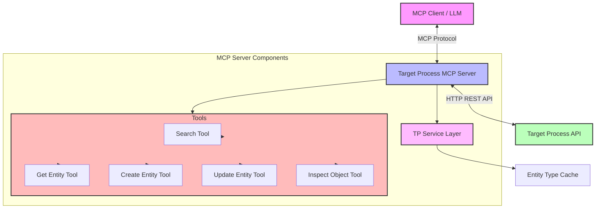
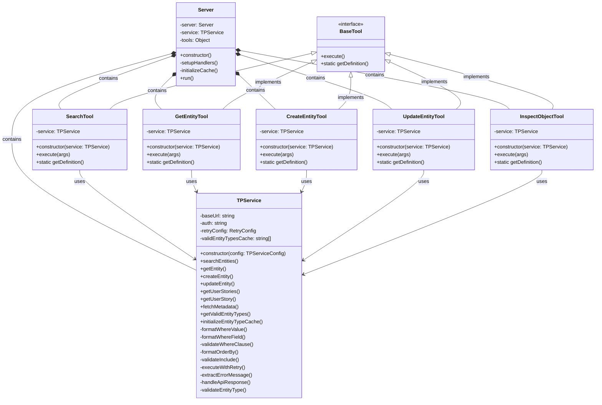
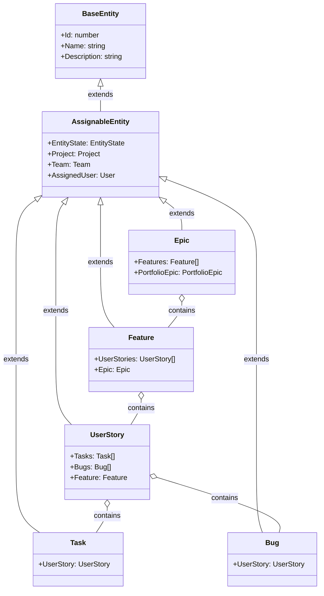
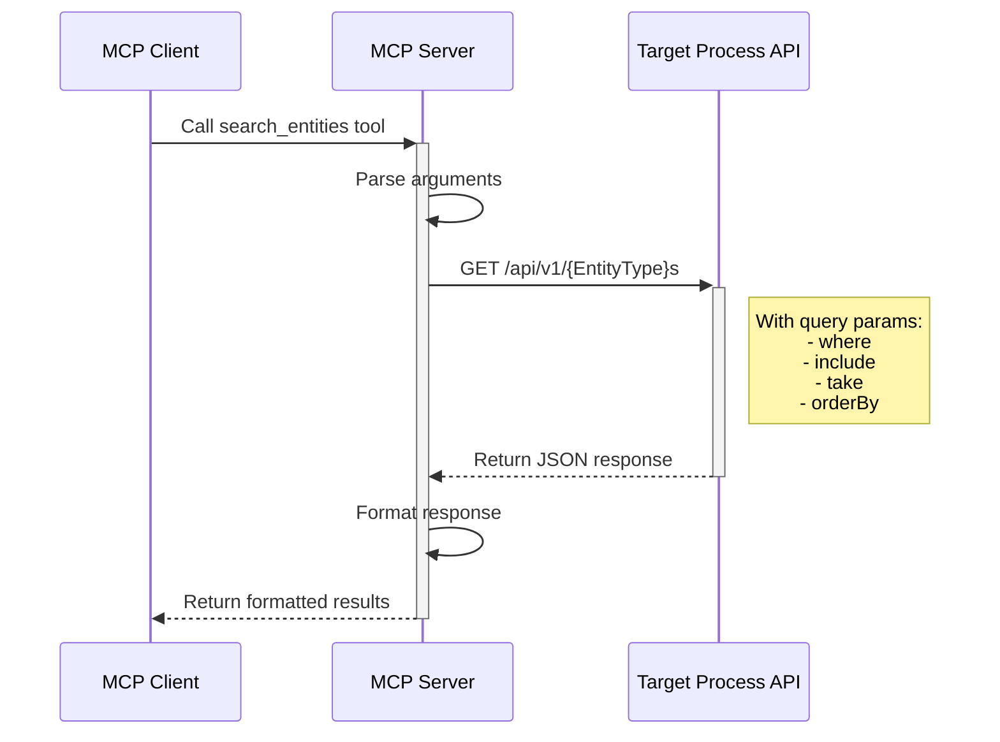
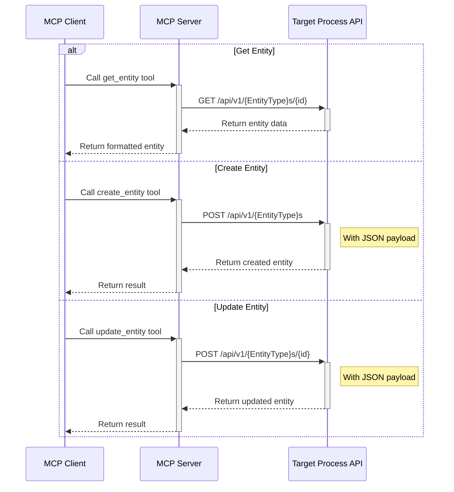
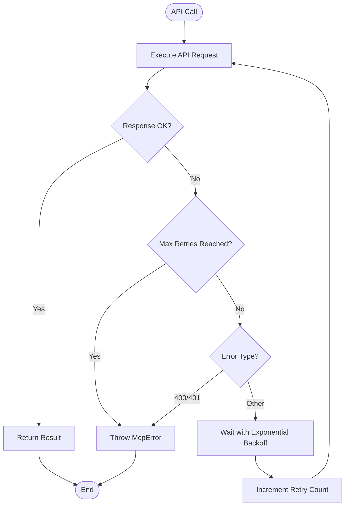
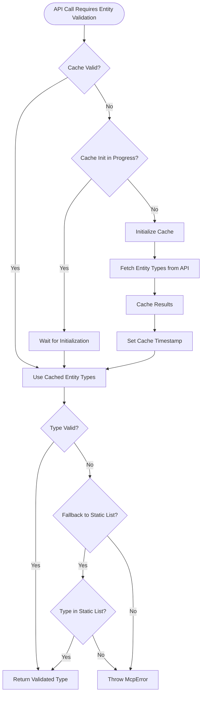

# Target Process MCP Architecture

This document outlines the architecture of the Target Process Model Context Protocol (MCP) implementation, including system structure, class diagrams, and transaction models.

## System Overview

The Target Process MCP server provides an interface between Large Language Models (LLMs) and the Target Process API, enabling AI assistants to perform operations such as searching, retrieving, creating, and updating Target Process entities.

## System Architecture

## Class Diagram

## Entity Data Models

## Transaction Models

### Search Flow

### Entity CRUD Operations

### Error Handling and Retry Logic

## Configuration and Initialization

The Target Process MCP server can be configured in two ways:

1. **Environment Variables:**
   - `TP_DOMAIN`: Target Process domain (e.g., "company.tpondemand.com")
   - `TP_USERNAME`: Username for authentication
   - `TP_PASSWORD`: Password for authentication

2. **Configuration File:**
   - Located at `config/targetprocess.json`
   - Contains domain and credential information

During initialization, the server:

1. Loads configuration
2. Initializes the TP Service with configuration
3. Creates tool instances
4. Sets up MCP request handlers
5. Initializes entity type cache in the background

## Caching Strategy

The server maintains a cache of valid entity types to improve performance:

## Semantic Operations Philosophy

The Target Process MCP Server implements a **semantic operations architecture** that transforms low-level API interactions into high-level, context-aware workflows. This approach is fundamental to understanding how this system differs from traditional API wrappers.

### What Are Semantic Operations?

Semantic operations are intent-driven abstractions that:
- **Understand Context**: Know who you are, what role you play, and what you're trying to achieve
- **Guide Workflows**: Provide suggestions for next steps based on current state
- **Handle Complexity**: Encapsulate multi-step processes into single, meaningful actions
- **Adapt Dynamically**: Discover system configuration rather than hardcoding assumptions

### Core Design Principles

1. **Work Context Over Data Structure**: Operations map to how people think about their work, not how data is stored
2. **Discovery Over Configuration**: Dynamically discover states, priorities, and workflows rather than hardcoding
3. **Guidance Over Documentation**: Operations suggest next steps, teaching workflows through use
4. **Role Awareness**: Same operation behaves differently based on who's using it
5. **Graceful Degradation**: When discovery fails, fall back to sensible defaults with warnings

For detailed information about semantic operations, including implementation patterns, role-based filtering, and examples, please refer to the [Semantic Operations Documentation](./semantic-operations/README.md).

## Conclusion

The Target Process MCP architecture follows a layered approach with clean separation of concerns:

1. **MCP Server Layer**: Handles communication with the MCP client
2. **Tool Layer**: Implements specific operations as MCP tools
3. **Service Layer**: Provides reusable API communication logic
4. **API Layer**: Communicates with the Target Process REST API
5. **Semantic Operations Layer**: Provides intelligent, context-aware workflows on top of the raw tools

This architecture ensures maintainability, extensibility, and robust error handling throughout the system, while the semantic operations layer adds intelligence and context awareness that makes the system truly helpful for users.
