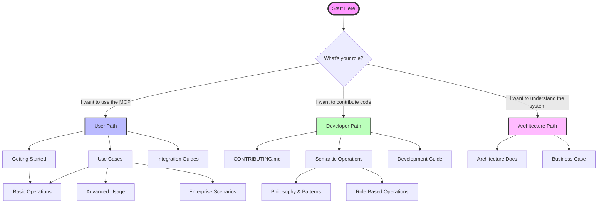

# TargetProcess MCP Documentation

Welcome to the Targetprocess MCP documentation! This guide will help you navigate our documentation based on your role and needs.

## 🗺️ Documentation Map

## 🚀 Quick Start Paths

### 👤 For Users (I want to use the MCP)

**Start Here:** If you want to integrate Targetprocess MCP with your AI assistant or use it in your workflow.

1. **[Getting Started](getting-started.md)** - Installation and basic setup
2. **[Integration Guides](integration/)** - Connect with Claude, Cline, or other AI assistants
3. **[Basic Operations](use-cases/basic-operations.md)** - Common tasks and examples
4. **[Advanced Usage](use-cases/advanced-usage.md)** - Complex scenarios and optimization

### 👨‍💻 For Developers (I want to contribute)

**Start Here:** If you want to contribute code, fix bugs, or add features.

⚠️ **MANDATORY READING BEFORE CONTRIBUTING** ⚠️

This project is NOT just another API wrapper! We implement **SEMANTIC OPERATIONS** - intelligent, context-aware workflows. Before writing ANY code:

1. **READ [CONTRIBUTING.md](../CONTRIBUTING.md)** - Required for ALL contributors
2. **UNDERSTAND [Semantic Operations](semantic-operations/)** - This is the HEART of the project
3. **ACCEPT the philosophy** - We build tools that think, not just call APIs

**If you skip this, your PR will be rejected.**

1. **[CONTRIBUTING.md](../CONTRIBUTING.md)** - Contribution guidelines (READ FIRST!)
2. **[Semantic Operations Overview](semantic-operations/)** - Core philosophy (MUST READ)
3. **[Development Guide](development/README.md)** - Setup and patterns
4. **[Tool Documentation](tools/)** - Individual tool details

### 🏗️ For Architects (I want to understand the system)

**Start Here:** If you want to understand the system design, architecture, or business value.

1. **[Architecture Overview](ARCHITECTURE.md)** - System design and philosophy
2. **[Business Case](BUSINESS-CASE.md)** - ROI and value proposition
3. **[Semantic Operations Design](semantic-operations/)** - Advanced patterns
4. **[Technical Architecture](architecture/)** - Detailed diagrams

## 📚 Full Documentation Index

### Quick Start
- [Getting Started](getting-started.md) - Installation and basic setup
- [Security & Authentication](security-and-authentication.md) - Credential management and security
- [Integration](integration/) - Platform-specific integration guides

## Core Concepts
- [Architecture](ARCHITECTURE.md) - System architecture and design
- [Core Concepts](core-concepts.md) - Fundamental concepts and terminology
- [Adaptive Architecture](adaptive-architecture.md) - Advanced architectural patterns
- [Workflow Architecture](petri-net-architecture-guide.md) - Multi-entry workflow design patterns

## User Guides

### Role-Based Operations
- [Semantic Operations](semantic-operations/) - Role-based workflow operations
  - [Developer](semantic-operations/developer.md) - Task management and development workflows
  - [Project Manager](semantic-operations/project-manager.md) - Team coordination and oversight
  - [QA Tester](semantic-operations/tester.md) - Quality assurance and testing
  - [Product Owner](semantic-operations/product-owner.md) - Product strategy and backlog management

### Raw API Operations
- [Tools Reference](tools/) - Low-level MCP tools for direct API access
  - [Search Entities](tools/search-entities.md) - Entity search and filtering
  - [Get Entity](tools/get-entity.md) - Entity retrieval
  - [Create Entity](tools/create-entity.md) - Entity creation
  - [Update Entity](tools/update-entity.md) - Entity modification
  - [Inspect Object](tools/inspect-object.md) - API introspection

### Use Cases
- [Use Cases Overview](use-cases/) - Common usage scenarios and examples
- [Basic Operations](use-cases/basic-operations.md) - Fundamental operations
- [Advanced Usage](use-cases/advanced-usage.md) - Complex patterns and optimization
- [Data Analysis](use-cases/data-analysis.md) - Analytics and reporting
- [Enterprise Use Cases](use-cases/enterprise-use-cases.md) - Large-scale deployments

## Integration Guides
- [Claude Code](integration/claude-code.md) - Integration with Claude Code IDE
- [Claude Desktop](integration/claude-desktop.md) - Desktop application setup
- [CLI Usage](integration/cli-usage.md) - Command-line interface
- [Toolkit Integration](integration/toolkit-integration.md) - IBM watsonx Orchestrate
- [Installation](integration/installation.md) - Detailed installation guide
- [Troubleshooting](integration/troubleshooting.md) - Common issues and solutions

## Technical Documentation

### Architecture
- [Components](architecture/components.md) - System components and relationships
- [Data Models](architecture/data-models.md) - Entity structure and relationships
- [Transaction Flows](architecture/transaction-flows.md) - API interaction patterns
- [Overview](architecture/overview.md) - High-level architecture summary

### Development
- [Development Guide](development.md) - Contributing and extending
- [Development Patterns](development/README.md) - Development practices and code organization

## Business Documentation
- [Business Case](BUSINESS-CASE.md) - Business value and ROI
- [Executive Presentation](EXECUTIVE-PRESENTATION.md) - Executive summary
- [Additional Reading](additional-reading.md) - External resources and references

## Configuration and Setup
- Environment variables and configuration options are documented in each integration guide
- [Personality configurations](../config/personalities/) define role-based operation sets
- See [Getting Started](getting-started.md) for initial setup

## 🎯 Common Scenarios

### "I want to..."

#### ...search for work items
→ Start with [Basic Operations](use-cases/basic-operations.md#finding-entities)

#### ...integrate with my AI assistant
→ See [Integration Guides](integration/) for your specific platform

#### ...understand semantic operations
→ **Required reading**: [Semantic Operations Overview](semantic-operations/)

#### ...contribute a new feature
→ Read [CONTRIBUTING.md](../CONTRIBUTING.md) first, then [Development Guide](development/README.md)

#### ...analyze large datasets
→ Check [Enterprise Use Cases](use-cases/enterprise-use-cases.md)

#### ...troubleshoot an issue
→ See [Troubleshooting Guide](integration/troubleshooting.md)

#### ...set up authentication
→ Read [Security & Authentication](security-and-authentication.md)

## 📖 Reading Paths by Experience Level

### 🌱 Beginner Path
1. [Getting Started](getting-started.md)
2. [Core Concepts](core-concepts.md)
3. [Basic Operations](use-cases/basic-operations.md)
4. [Integration Guide](integration/) (for your platform)

### 🌿 Intermediate Path
1. [Semantic Operations Overview](semantic-operations/)
2. [Advanced Usage](use-cases/advanced-usage.md)
3. [Architecture Overview](ARCHITECTURE.md)
4. [Role-Based Operations](semantic-operations/developer.md) (pick your role)

### 🌳 Advanced Path
1. [Development Guide](development/README.md)
2. [Semantic Hints Pattern](development/semantic-hints-pattern.md)
3. [Technical Architecture](architecture/)
4. [Enterprise Use Cases](use-cases/enterprise-use-cases.md)

## Support and Community
- Issues and feature requests: [GitHub Issues](https://github.com/aaronsb/apptio-target-process-mcp/issues)
- Documentation improvements welcome via pull requests
- See [CONTRIBUTING.md](../CONTRIBUTING.md) for contributing guidelines

---

**Remember:** For contributors, understanding [Semantic Operations](semantic-operations/) is not optional—it's the foundation of this project!