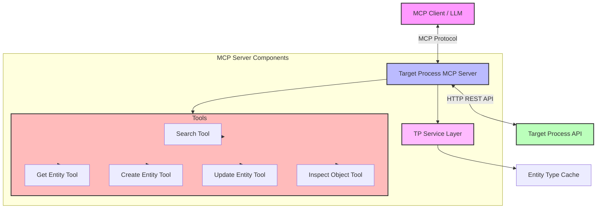

# Targetprocess MCP Architecture

This directory contains documentation on the architecture of the Targetprocess MCP Server, including system structure, class diagrams, and transaction models.

## Contents

- [System Overview](overview.md) - High-level overview of the system architecture
- [Component Design](components.md) - Detailed design of each system component
- [Data Models](data-models.md) - Entity data models and relationships
- [Transaction Flows](transaction-flows.md) - Sequence diagrams for common operations

## System Architecture at a Glance

## Key Architecture Principles

1. **Layered Architecture**: Clean separation between:
   - MCP Server Layer
   - Tool Implementation Layer
   - Service Layer
   - API Communication Layer

2. **Separation of Concerns**:
   - Each tool handles a specific operation type
   - Service layer abstracts API communication
   - Tools are isolated and independently testable

3. **Robustness**:
   - Comprehensive error handling
   - Retry mechanisms for API calls
   - Input validation and sanitization
   - Detailed error messages for debugging

4. **Performance**:
   - Caching for frequently accessed data
   - Optimized query execution
   - Incremental data fetching
   - Batched operations when possible

5. **Extensibility**:
   - Easy to add new tools
   - Entity model can be extended
   - Service layer can be enhanced without affecting tools

## Development Approach

The architecture follows modern TypeScript practices:

- **Type Safety**: Strong typing throughout the codebase
- **Async/Await**: Modern asynchronous patterns
- **Error Handling**: Comprehensive error handling with specific error types
- **Modularity**: Clear module boundaries and interfaces
- **Testability**: Components designed for easy testing

For more detailed architecture documentation, please refer to the individual documents in this directory.