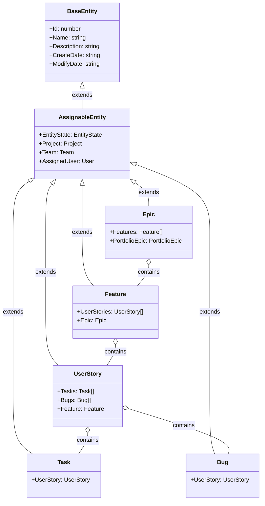

# Entity Data Models

This document outlines the entity data models used in the Targetprocess MCP, their relationships, and inheritance structure.

## Entity Hierarchy

The Targetprocess entity model follows a hierarchical structure with inheritance:



## Core Entity Types

### BaseEntity

The base entity from which all other entities inherit:

```typescript
interface BaseEntity {
  Id: number;
  Name: string;
  Description: string;
  CreateDate: string;
  ModifyDate: string;
  CustomFields?: Record<string, any>;
  Tags?: string[];
}
```

### AssignableEntity

Entities that can be assigned to users, teams, and have states:

```typescript
interface AssignableEntity extends BaseEntity {
  EntityState: EntityState;
  Project: Project;
  Team: Team;
  AssignedUser: User;
  Priority?: Priority;
  Effort?: number;
  TimeSpent?: number;
  StartDate?: string;
  EndDate?: string;
  DueDate?: string;
}
```

## Primary Entity Types

### UserStory

User stories represent features from the user's perspective:

```typescript
interface UserStory extends AssignableEntity {
  Tasks?: Task[];
  Bugs?: Bug[];
  Feature?: Feature;
  Release?: Release;
  Iteration?: Iteration;
  TeamIteration?: TeamIteration;
}
```

### Task

Tasks represent discrete pieces of work:

```typescript
interface Task extends AssignableEntity {
  UserStory?: UserStory;
  RemainingTime?: number;
  TimeSpent?: number;
}
```

### Bug

Bugs represent defects that need to be fixed:

```typescript
interface Bug extends AssignableEntity {
  UserStory?: UserStory;
  Severity?: Severity;
  ReproductionSteps?: string;
}
```

### Feature

Features represent collections of related user stories:

```typescript
interface Feature extends AssignableEntity {
  UserStories?: UserStory[];
  Epic?: Epic;
  Release?: Release;
}
```

### Epic

Epics represent large bodies of work:

```typescript
interface Epic extends AssignableEntity {
  Features?: Feature[];
  PortfolioEpic?: PortfolioEpic;
  Release?: Release;
}
```

## Supporting Entity Types

### Project

Projects organize work items:

```typescript
interface Project extends BaseEntity {
  Owner?: User;
  Teams?: Team[];
  Program?: Program;
  UserStories?: UserStory[];
  Features?: Feature[];
  Epics?: Epic[];
  Releases?: Release[];
  Iterations?: Iteration[];
}
```

### Team

Teams represent groups of users:

```typescript
interface Team extends BaseEntity {
  Users?: User[];
  Projects?: Project[];
  TeamIterations?: TeamIteration[];
  Capacity?: number;
}
```

### User

Users represent individual team members:

```typescript
interface User extends BaseEntity {
  FirstName: string;
  LastName: string;
  Email: string;
  Teams?: Team[];
  AssignedItems?: AssignableEntity[];
}
```

### EntityState

States represent the workflow status of items:

```typescript
interface EntityState extends BaseEntity {
  WorkflowStep: string;
  IsInitial: boolean;
  IsFinal: boolean;
  NextStates?: EntityState[];
}
```

### Priority

Priorities represent the importance of items:

```typescript
interface Priority extends BaseEntity {
  Importance: number;
  Color: string;
}
```

## Time Management Entities

### Release

Releases represent planned product releases:

```typescript
interface Release extends BaseEntity {
  StartDate: string;
  EndDate: string;
  Project: Project;
  Features?: Feature[];
  UserStories?: UserStory[];
}
```

### Iteration

Iterations represent time-boxed work periods:

```typescript
interface Iteration extends BaseEntity {
  StartDate: string;
  EndDate: string;
  Project: Project;
  UserStories?: UserStory[];
}
```

### TeamIteration

Team iterations associate iterations with teams:

```typescript
interface TeamIteration extends BaseEntity {
  StartDate: string;
  EndDate: string;
  Team: Team;
  UserStories?: UserStory[];
  Capacity?: number;
}
```

## Custom Fields (Enhanced Discovery v2.0+)

Custom fields are handled through the `CustomFields` property on the BaseEntity:

```typescript
interface BaseEntity {
  // ...
  CustomFields?: Record<string, any>;
}
```

Example:

```json
{
  "Id": 12345,
  "Name": "Implement login",
  "CustomFields": {
    "RiskLevel": "Medium",
    "BusinessValue": 8,
    "ReleaseNotes": "Added secure login capability",
    "Stakeholder": "Product Team"
  }
}
```

### Custom Field Discovery

**Current Approach** (v2.0+):
- Basic entity information indicates if custom fields are supported
- Actual custom field discovery requires additional API calls
- Use `search_entities` with `include=[CustomFields]` for discovery

**Enhanced Metadata Response**:
```json
{
  "basic_info": {
    "name": "StatusReport",
    "supportsCustomFields": true,
    "source": "API"
  },
  "note": "For detailed custom field information, use search_entities with include=[CustomFields]"
}
```

## Entity Relationships

The entity types have complex relationships:

### Hierarchical Relationships

1. **Portfolio Planning**:
   Portfolio Epic → Epic → Feature → User Story → Task/Bug

2. **Time Planning**:
   Program → Project → Release → Iteration/TeamIteration

3. **Team Organization**:
   Program → Project → Team → User

### Entity Containment

1. **Work Containment**:
   - UserStory contains Tasks and Bugs
   - Feature contains User Stories
   - Epic contains Features
   - PortfolioEpic contains Epics

2. **Project Containment**:
   - Project contains User Stories, Features, Epics
   - Project contains Releases and Iterations
   - Project is associated with Teams

3. **Time Containment**:
   - Release contains Features and User Stories
   - Iteration/TeamIteration contains User Stories

## Type Validation

Entity types are validated in two ways:

1. **Static Validation**: Using TypeScript enums and Zod schemas
2. **Dynamic Validation**: Using the API to fetch valid entity types at runtime

The TPService maintains a cache of valid entity types for efficient validation.

## Type Customization

Targetprocess allows for custom entity types and custom fields. The MCP handles this through:

1. **Dynamic Discovery**: Using the `inspect_object` tool to discover entity types
2. **Flexible Schemas**: Using `Record<string, any>` for custom fields
3. **Error Information**: Extracting valid entity types from error messages

This approach allows the MCP to work with customized Targetprocess instances without requiring code changes.