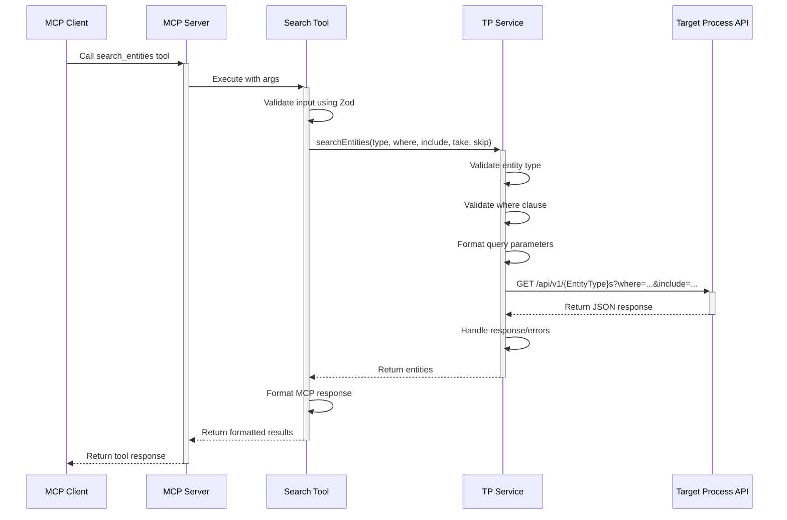
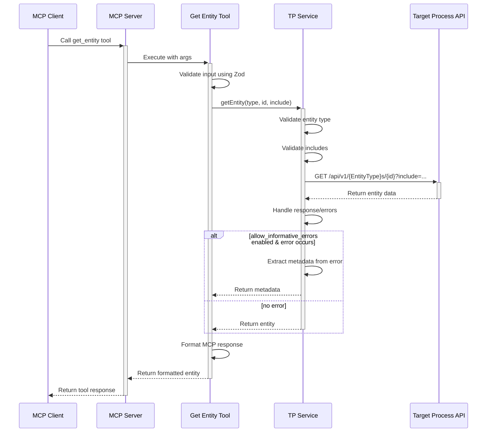
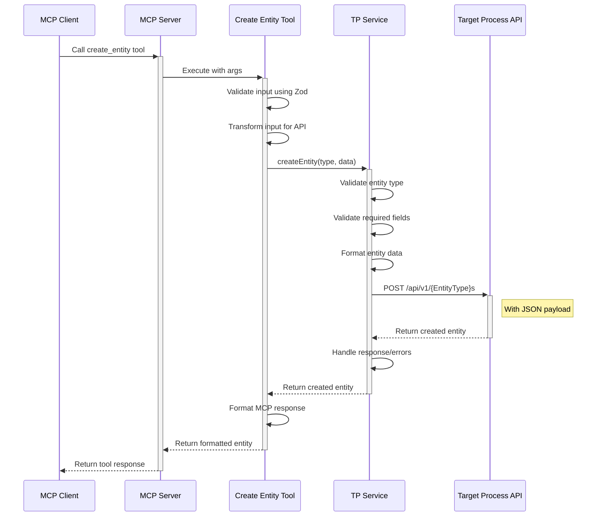
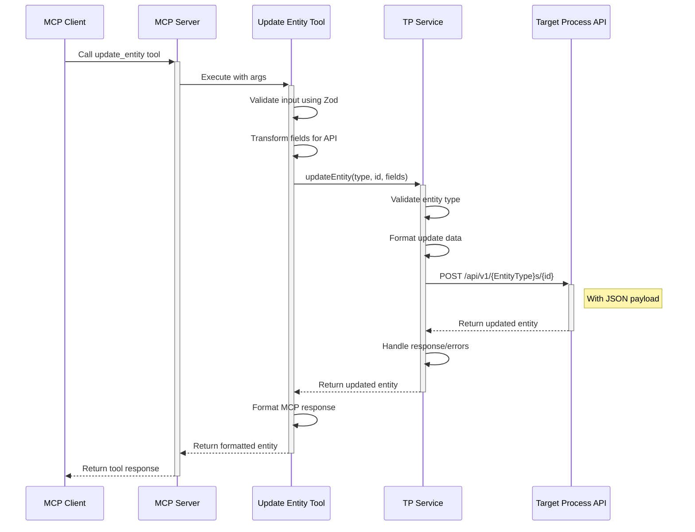
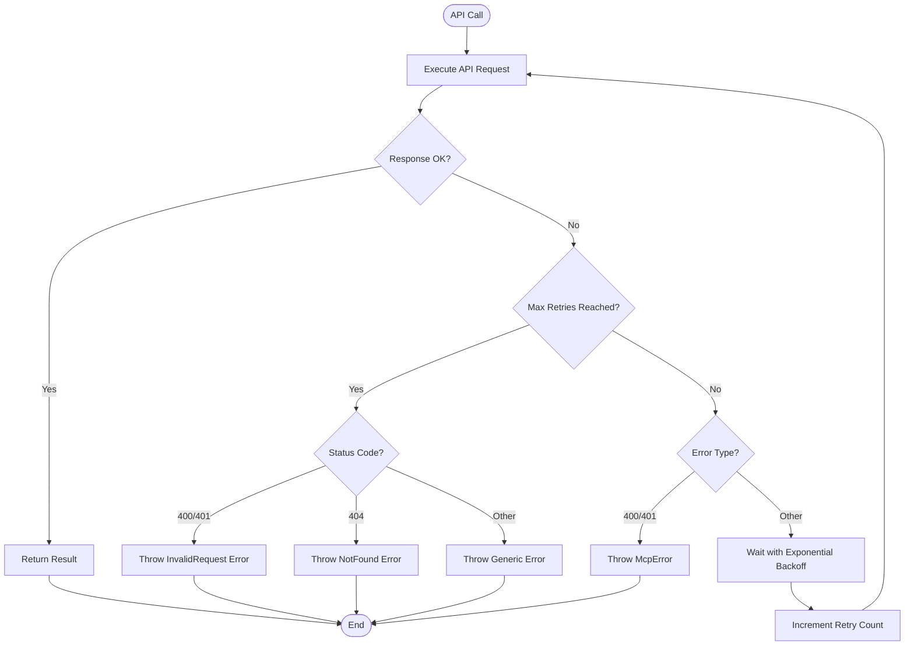
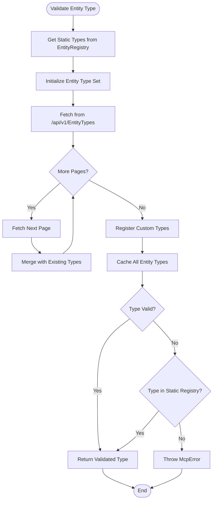
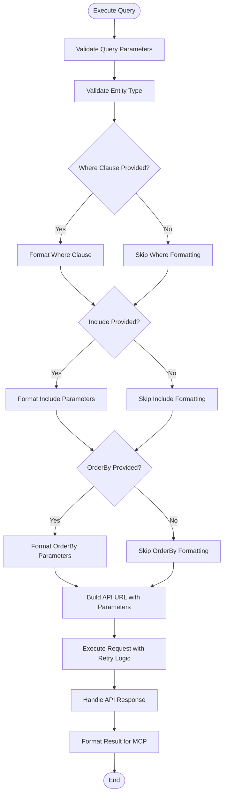
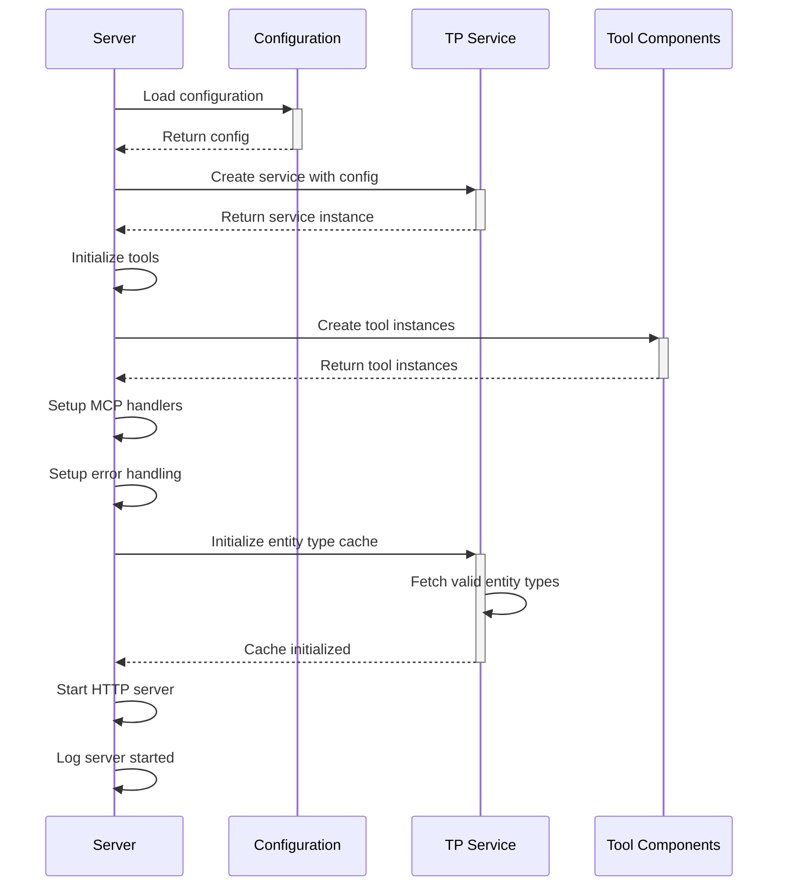
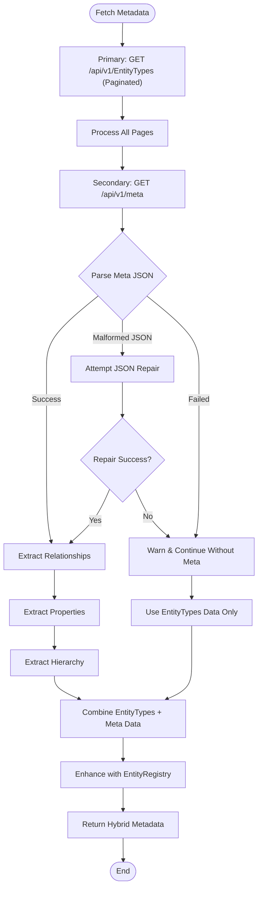

# Transaction Flows

This document outlines the key transaction flows in the Targetprocess MCP, including sequence diagrams for common operations and error handling patterns.

## Version 2.0+ Updates

**⚠️ Important Changes**: The inspect_object tool and metadata fetching have been significantly enhanced with a hybrid approach for improved performance and reliability. See the [Enhanced Inspect Object Flow](#inspect-object-flow-enhanced-v20) section for details.

## Search Flow

The search flow is used to find entities matching specific criteria:



## Get Entity Flow

The get entity flow retrieves a specific entity by ID:



## Create Entity Flow

The create entity flow creates a new entity:



## Update Entity Flow

The update entity flow modifies an existing entity:



## Inspect Object Flow (Enhanced v2.0+)

The inspect object flow examines metadata about entities and properties using a hybrid approach:

```mermaid
sequenceDiagram
    participant Client as MCP Client
    participant Server as MCP Server
    participant InspectTool as Inspect Object Tool
    participant TPService as TP Service
    participant EntityRegistry as Entity Registry
    participant TP as Target Process API
    
    Client->>+Server: Call inspect_object tool
    Server->>+InspectTool: Execute with args
    InspectTool->>InspectTool: Validate input using Zod
    
    alt action == "list_types"
        InspectTool->>+TPService: getValidEntityTypes()
        TPService->>TPService: Get static types from EntityRegistry
        TPService->>+TP: GET /api/v1/EntityTypes (paginated)
        TP-->>-TPService: Return entity types batch
        TPService->>TPService: Merge API + Registry types
        TPService->>TPService: Register custom types
        TPService-->>-InspectTool: Return complete entity types
    else action == "get_properties"
        InspectTool->>+TPService: fetchMetadata()
        
        Note over TPService: Hybrid Metadata Approach
        TPService->>+TP: GET /api/v1/EntityTypes (Primary)
        TP-->>-TPService: Return basic entity info
        
        TPService->>+TP: GET /api/v1/meta (Secondary)
        alt meta endpoint succeeds
            TP-->>-TPService: Return detailed metadata
            TPService->>TPService: Attempt JSON repair if needed
        else meta endpoint fails
            TP-->>-TPService: Return error
            Note over TPService: Graceful degradation
        end
        
        TPService->>TPService: createHybridMetadata()
        TPService->>+EntityRegistry: enhanceWithSystemTypes()
        EntityRegistry-->>-TPService: Return enhanced metadata
        TPService-->>-InspectTool: Return hybrid metadata
        
        InspectTool->>InspectTool: extractEntityProperties()
        InspectTool->>+EntityRegistry: getEntityTypeInfo()
        EntityRegistry-->>-InspectTool: Return registry info
        
    else action == "get_property_details"
        InspectTool->>+TPService: fetchMetadata()
        Note over TPService: Same hybrid approach as above
        TPService-->>-InspectTool: Return hybrid metadata
        InspectTool->>InspectTool: extractPropertyDetails()
        InspectTool->>+EntityRegistry: getEntityTypeInfo()
        EntityRegistry-->>-InspectTool: Return registry info
        
    else action == "discover_api_structure"
        InspectTool->>+TPService: fetchMetadata()
        TPService-->>-InspectTool: Return hybrid metadata
        
        alt hybrid metadata succeeds
            InspectTool->>InspectTool: Extract entity types
        else hybrid metadata fails
            InspectTool->>+TP: GET /api/v1/NonExistentType/1
            TP-->>-InspectTool: Return error with entity types
            InspectTool->>InspectTool: Extract types from error
        end
    end
    
    InspectTool->>InspectTool: Format MCP response with limitations
    InspectTool-->>-Server: Return formatted result
    Server-->>-Client: Return tool response
```

## Error Handling Flow

The error handling flow with retry logic:



## Enhanced Entity Type Validation Flow (v2.0+)

The enhanced entity type validation flow with hybrid approach:



## Query Execution Flow

The query execution flow with parameter formatting:



## Server Initialization Flow

The server initialization flow:



## MCP Request Processing Flow

The MCP request processing flow:

```mermaid
sequenceDiagram
    participant Client as MCP Client
    participant Server as MCP Server
    participant McpHandler as MCP Handler
    participant Tool as Tool Component
    
    Client->>+Server: Send MCP request
    Server->>+McpHandler: Process request
    McpHandler->>McpHandler: Parse request
    McpHandler->>McpHandler: Validate request format
    McpHandler->>McpHandler: Extract tool name and params
    
    McpHandler->>+Tool: Execute tool with params
    Tool->>Tool: Validate input parameters
    Tool->>Tool: Process request
    
    alt Success
        Tool-->>-McpHandler: Return result
        McpHandler->>McpHandler: Format MCP response
        McpHandler-->>-Server: Return success response
        Server-->>-Client: Return success response
    else Error
        Tool-->>-McpHandler: Throw error
        McpHandler->>McpHandler: Convert to MCP error
        McpHandler-->>-Server: Return error response
        Server-->>-Client: Return error response
    end
```

## Metadata Fetching Flow (New v2.0+)

The enhanced metadata fetching flow with hybrid approach:



## Performance Improvements (v2.0+)

### Response Time Comparison
- **v1.x**: `/api/v1/Index/meta` - 2-5 seconds (large response, JSON issues)
- **v2.0+**: `/api/v1/EntityTypes` - 0.3-1 second (paginated, reliable)

### Reliability Improvements
- **Graceful Fallback**: Works even if `/meta` endpoint fails
- **JSON Repair**: Attempts to fix malformed JSON responses
- **Pagination**: Handles large instances with 100+ entity types
- **Comprehensive Coverage**: Combines API + Registry for complete entity list

### Error Handling Enhancements
- **Informative Messages**: Clear explanations of limitations
- **Helpful Suggestions**: Guidance on alternative approaches
- **Graceful Degradation**: Continues to work with reduced functionality

These transaction flows demonstrate the key paths through the system and how different components interact during various operations. The v2.0+ enhancements provide significantly improved performance and reliability while maintaining backwards compatibility.