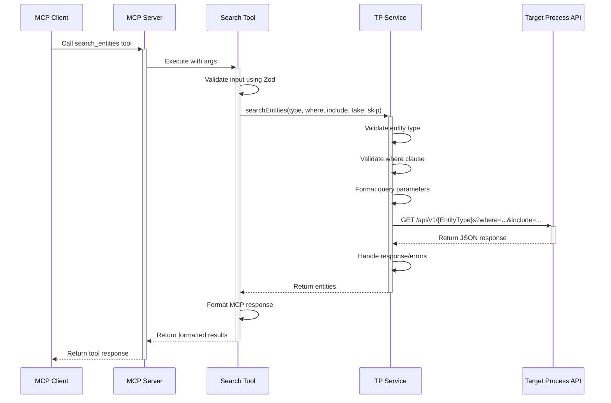
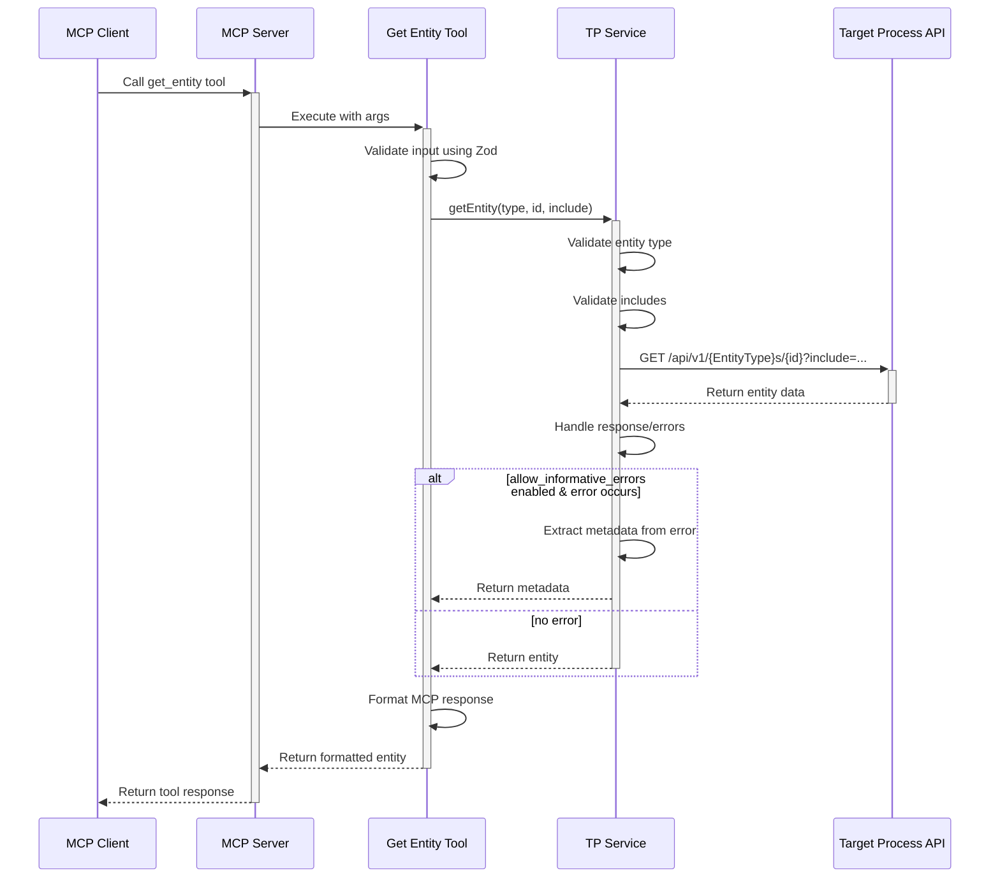
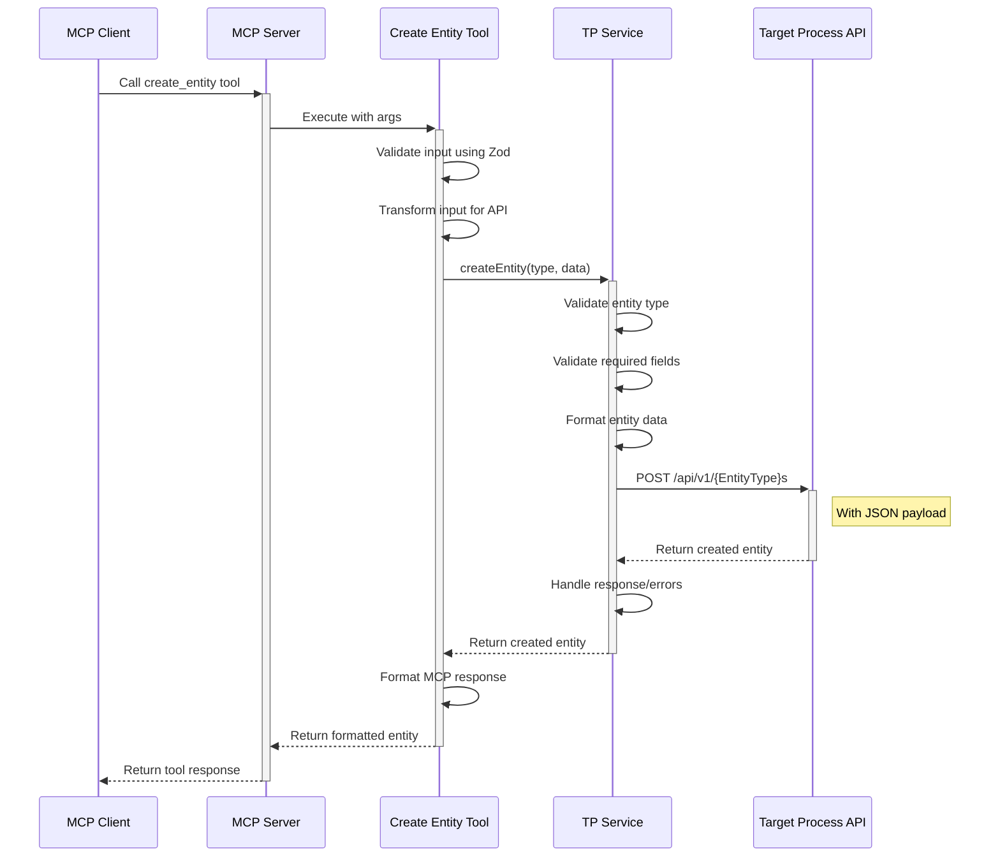
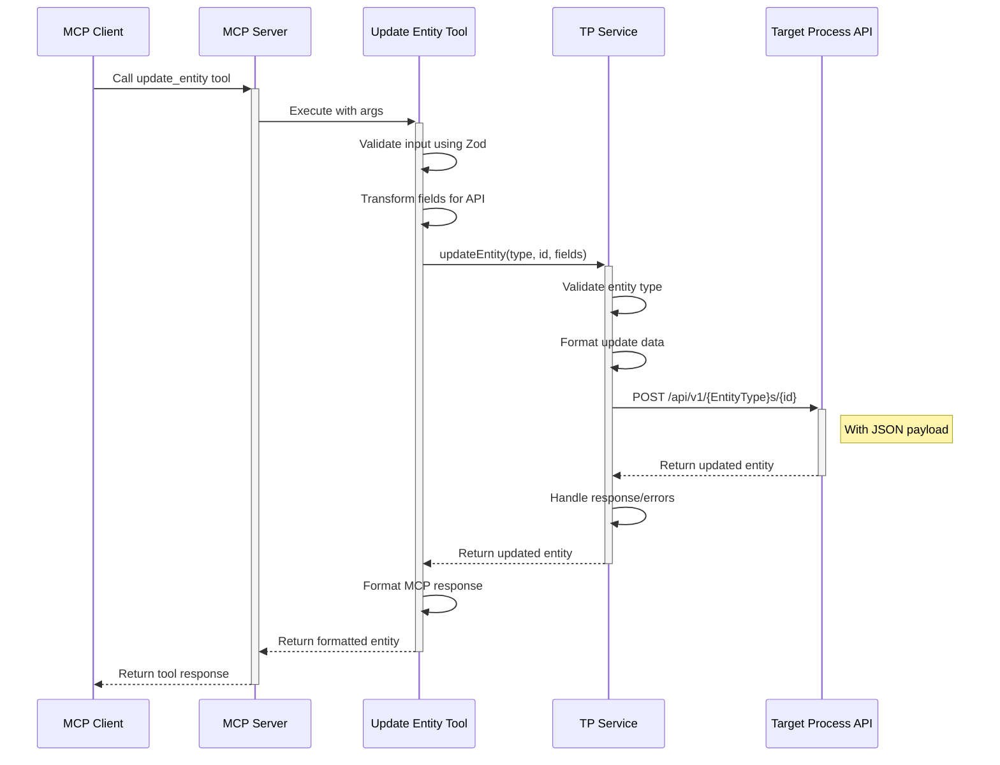
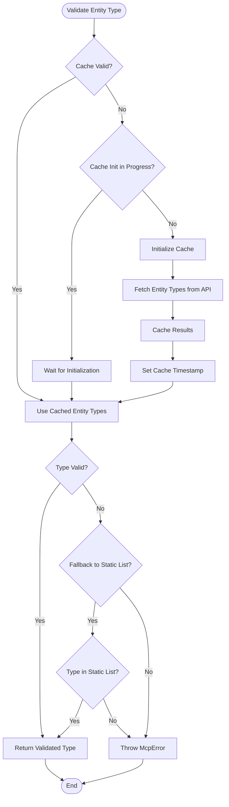
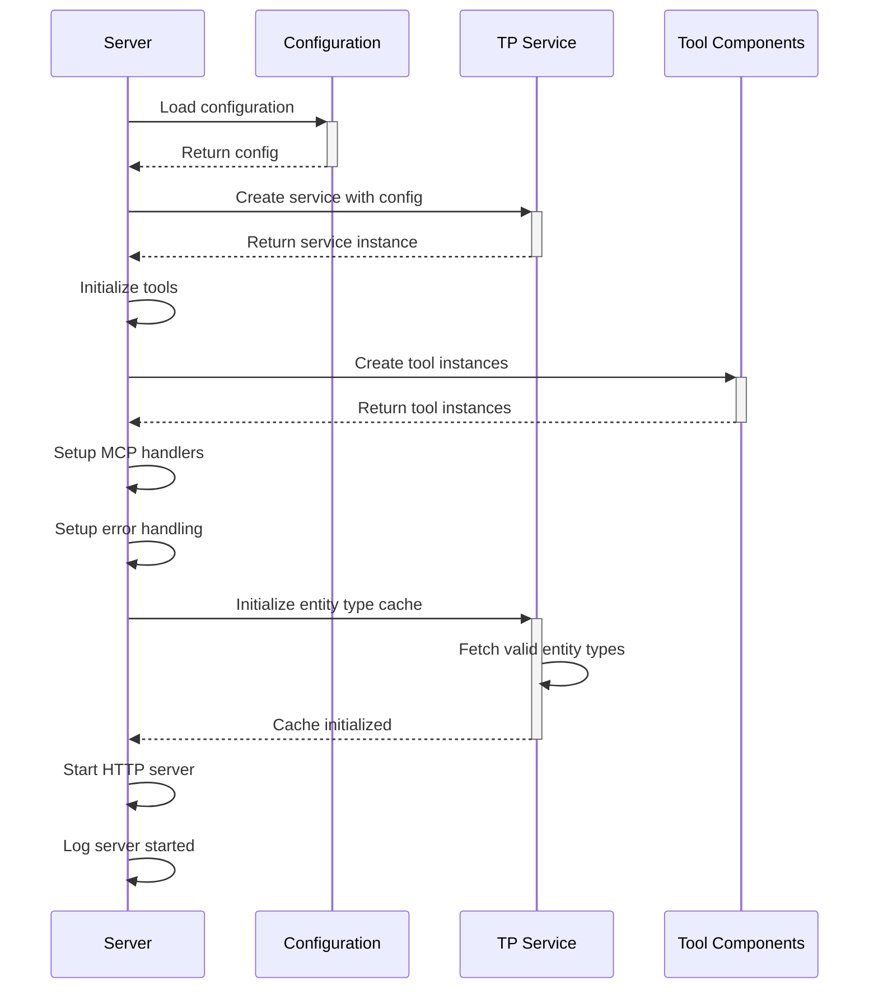

# Transaction Flows

This document outlines the key transaction flows in the Targetprocess MCP, including sequence diagrams for common operations and error handling patterns.

## Search Flow

The search flow is used to find entities matching specific criteria:



## Get Entity Flow

The get entity flow retrieves a specific entity by ID:



## Create Entity Flow

The create entity flow creates a new entity:



## Update Entity Flow

The update entity flow modifies an existing entity:



## Inspect Object Flow

The inspect object flow examines metadata about entities and properties:

```mermaid
sequenceDiagram
    participant Client as MCP Client
    participant Server as MCP Server
    participant InspectTool as Inspect Object Tool
    participant TPService as TP Service
    participant TP as Target Process API
    
    Client->>+Server: Call inspect_object tool
    Server->>+InspectTool: Execute with args
    InspectTool->>InspectTool: Validate input using Zod
    
    alt action == "list_types"
        InspectTool->>+TPService: getValidEntityTypes()
        TPService->>TPService: Check cache
        
        alt cache valid
            TPService-->>InspectTool: Return cached types
        else cache invalid
            TPService->>+TP: GET /api/v1/EntityTypes
            TP-->>-TPService: Return entity types
            TPService->>TPService: Update cache
            TPService-->>InspectTool: Return entity types
        end
    else action == "get_properties"
        InspectTool->>+TP: GET /api/v1/{EntityType}s/$metadata
        TP-->>-InspectTool: Return entity properties
    else action == "get_property_details"
        InspectTool->>+TP: GET /api/v1/{EntityType}s/$metadata
        TP-->>-InspectTool: Return entity properties
        InspectTool->>InspectTool: Extract property details
    else action == "discover_api_structure"
        InspectTool->>InspectTool: Try direct metadata first
        InspectTool->>+TP: GET /api/v1/$metadata
        
        alt direct metadata succeeds
            TP-->>-InspectTool: Return API metadata
        else direct metadata fails
            TP-->>-InspectTool: Return error
            InspectTool->>+TP: GET /api/v1/InvalidType/1
            TP-->>-InspectTool: Return error with valid types
            InspectTool->>InspectTool: Extract types from error
        end
    end
    
    InspectTool->>InspectTool: Format MCP response
    InspectTool-->>-Server: Return formatted result
    Server-->>-Client: Return tool response
```

## Error Handling Flow

The error handling flow with retry logic:


## Entity Type Validation Flow

The entity type validation flow:



## Query Execution Flow

The query execution flow with parameter formatting:


## Server Initialization Flow

The server initialization flow:



## MCP Request Processing Flow

The MCP request processing flow:

```mermaid
sequenceDiagram
    participant Client as MCP Client
    participant Server as MCP Server
    participant McpHandler as MCP Handler
    participant Tool as Tool Component
    
    Client->>+Server: Send MCP request
    Server->>+McpHandler: Process request
    McpHandler->>McpHandler: Parse request
    McpHandler->>McpHandler: Validate request format
    McpHandler->>McpHandler: Extract tool name and params
    
    McpHandler->>+Tool: Execute tool with params
    Tool->>Tool: Validate input parameters
    Tool->>Tool: Process request
    
    alt Success
        Tool-->>-McpHandler: Return result
        McpHandler->>McpHandler: Format MCP response
        McpHandler-->>-Server: Return success response
        Server-->>-Client: Return success response
    else Error
        Tool-->>-McpHandler: Throw error
        McpHandler->>McpHandler: Convert to MCP error
        McpHandler-->>-Server: Return error response
        Server-->>-Client: Return error response
    end
```

These transaction flows demonstrate the key paths through the system and how different components interact during various operations.