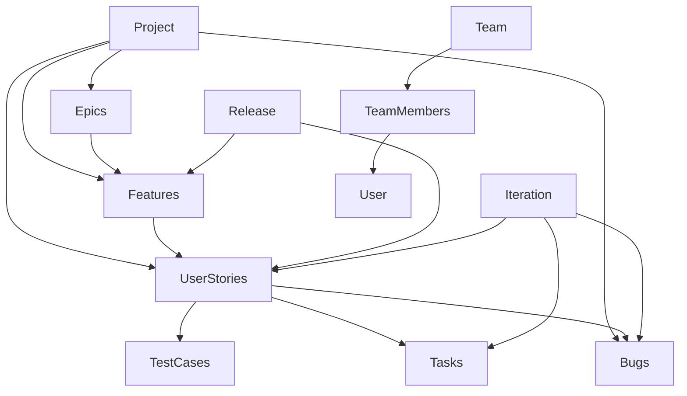
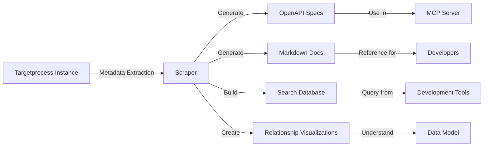
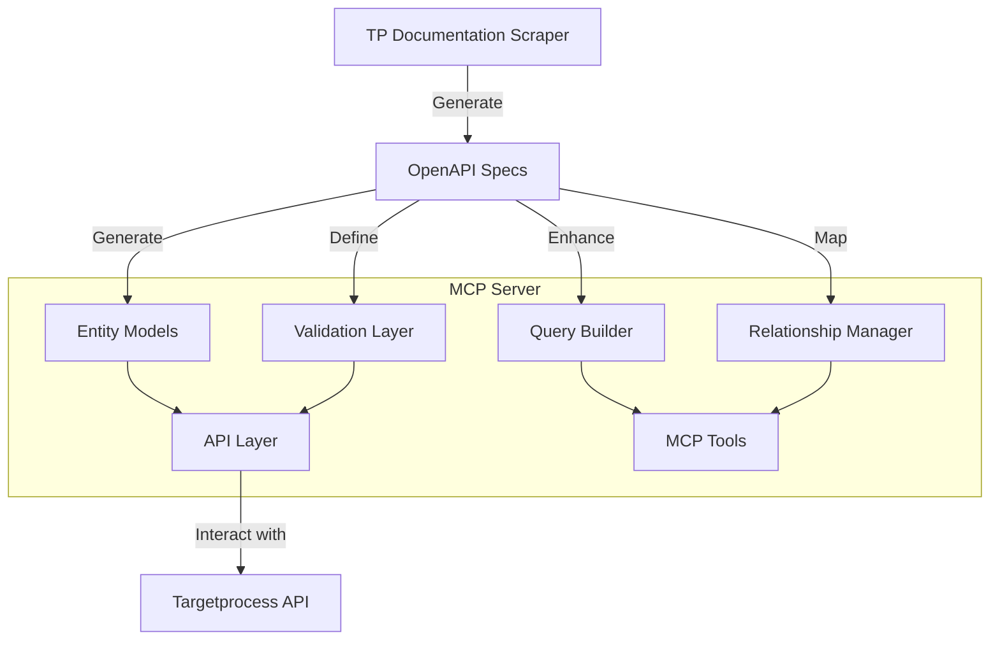
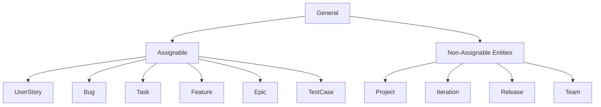

# Target Process Documentation Scraper: Findings and Development Opportunities

## Executive Summary

The Target Process Documentation Scraper ([GitHub Repository](https://github.com/aaronsb/target-process-docs)) represents a significant opportunity to enhance the Targetprocess MCP server development. Our evaluation reveals a comprehensive toolset that generates detailed API documentation, OpenAPI specifications, and relationship maps from any Targetprocess instance. This tool can transform our understanding of the Targetprocess API and dramatically improve both development efficiency and feature completeness of the MCP server.

## Key Findings

### 1. Comprehensive Entity Documentation

The documentation scraper captures detailed information about all standard and custom Target Process entities. In our analysis, we found:

- Documentation for 76+ standard system resources (User Stories, Projects, Features, etc.)
- Documentation for 150+ custom entity types that vary between Targetprocess instances
- Complete property listings for each entity, including data types, validation rules, and descriptions
- Detailed information on whether properties are required, read-only, or deprecated

This level of detail far exceeds what's publicly available through Targetprocess's own documentation, providing developers with the "ground truth" of the actual API implementation rather than just high-level descriptions.

### 2. OpenAPI Specification Generation

The scraper automatically generates formal OpenAPI (formerly Swagger) specifications that describe the complete API surface:

- 444+ endpoint definitions covering all entity CRUD operations
- Detailed request/response schemas for each operation
- Parameter definitions including validation constraints
- Complete type definitions that could be used to generate TypeScript interfaces

The OpenAPI specification represents a formal contract of the API that can be used for code generation, testing, and validation, eliminating much of the guesswork currently involved in API integration.

### 3. Entity Relationship Mapping

One of the most valuable aspects of the scraper is its ability to map relationships between entities:

- Parent-child relationships between entities (e.g., Project contains Features)
- Reference relationships (e.g., a Bug references a User Story)
- Collection relationships (e.g., a Project has many Team Members)
- Inheritance hierarchies (e.g., all entities that inherit from Assignable)

These relationships are critical for implementing proper navigation between entities and for building more intelligent query capabilities in the MCP server.

### 4. Instance-Specific Customization Detection

Targetprocess instances can be heavily customized, and the scraper captures these customizations:

- Custom entity types specific to an organization
- Custom fields added to standard entities
- Custom workflows and states
- Organization-specific relationships

This capability is essential for building an MCP server that can adapt to different Targetprocess configurations rather than being limited to a fixed set of entities.

### 5. Searchable Documentation

The scraper generates not just raw data but also searchable documentation:

- Markdown documentation for each entity type
- Full-text search capabilities across the entire documentation
- Categorized search results by entity type, property, or operation
- Interactive navigation between related entities

## Development Opportunities

### 1. Enhanced Entity Models

The current MCP server implements a subset of Targetprocess entities using manually created TypeScript interfaces. The scraped documentation enables:

- Complete coverage of all entity types through generated interfaces
- Accurate property definitions including proper typing
- Validation rules that match Targetprocess's actual constraints
- Support for custom fields and entity types

**Implementation Approach:**
Generate TypeScript interfaces directly from the OpenAPI specifications, either as a one-time code generation or as an ongoing part of the build process that adapts to changes in the Targetprocess API.

### 2. Advanced Query Builder

The current search_entities tool supports basic querying, but the documentation reveals opportunities for much more powerful query capabilities:

- Support for complex where clauses with nested conditions
- Include directives for fetching related entities in a single query
- Field selection to reduce payload size
- Sorting and pagination options

**Implementation Approach:**
Use the documented query parameters to enhance the query builder, exposing more of Targetprocess's native querying capabilities through the MCP interface.

### 3. Relationship Navigation

The MCP server could leverage the relationship information to provide more intelligent entity navigation:

- Automatic retrieval of related entities (e.g., getting all Tasks for a User Story)
- Bidirectional relationship traversal
- Relationship creation and management
- Type-safe relationship operations

**Implementation Approach:**
Implement a relationship manager that uses the documented entity relationships to provide methods for fetching, creating, and managing relationships between entities.

### 4. Custom Entity Support

With the detailed information about custom entities, the MCP server could support:

- Dynamic addition of custom entity types without code changes
- Custom field support across all operations
- Organization-specific workflows and states
- Custom relationship types

**Implementation Approach:**
Implement a dynamic entity system that can adapt to the specific Targetprocess instance it's connected to, loading entity definitions at runtime rather than having them hardcoded.

### 5. Validation and Error Handling

The documentation provides detailed information about validation rules that could be used to:

- Validate requests before sending them to the API
- Provide more specific error messages when validation fails
- Handle specific error conditions more gracefully
- Ensure consistent data integrity

**Implementation Approach:**
Generate validation schemas from the OpenAPI specifications and implement pre-request validation to catch errors early.

## Suggested Diagrams

To better communicate these findings and opportunities, we recommend creating the following diagrams:

### 1. Entity Relationship Diagram (ERD)
Show the key entities in Targetprocess and their relationships, highlighting the complexity and interconnectedness of the data model.

### 2. Documentation Generation Flow Diagram
Illustrate how the documentation scraper works, from connecting to a Targetprocess instance to generating the various documentation artifacts.

### 3. MCP Server Enhancement Architecture
Show how the MCP server architecture could evolve to incorporate the insights from the documentation scraper.

### 4. Entity Type Hierarchy
Visualize the inheritance hierarchy of Targetprocess entities to understand the object-oriented structure of the API.

## Implementation Roadmap

Based on our findings, we propose the following phased approach to integrating the documentation scraper insights into the MCP server:

1. **Phase 1: Entity Model Enhancement**
   - Generate TypeScript interfaces from OpenAPI specs
   - Update existing entity classes to match the generated interfaces
   - Add support for additional standard entities

2. **Phase 2: Query Builder Improvements**
   - Enhance the search_entities tool with additional query parameters
   - Implement support for include directives
   - Add field selection capabilities

3. **Phase 3: Relationship Management**
   - Implement a relationship manager service
   - Add convenience methods for navigating between related entities
   - Support creating and managing relationships

4. **Phase 4: Custom Entity Support**
   - Implement dynamic entity registration
   - Add support for custom fields
   - Handle custom workflows and states

5. **Phase 5: Validation and Error Handling**
   - Generate validation schemas from OpenAPI specs
   - Implement pre-request validation
   - Enhance error handling and reporting

## Conclusion

The Target Process Documentation Scraper represents a significant opportunity to enhance the Targetprocess MCP server. By leveraging the comprehensive API documentation, OpenAPI specifications, and relationship mapping, we can build a more complete, accurate, and powerful integration with Targetprocess. The resulting MCP server will be more adaptable to different Targetprocess instances, support a wider range of operations, and provide a more robust developer experience.

We recommend incorporating this tool into the development workflow and using its outputs to drive the next generation of MCP server features.