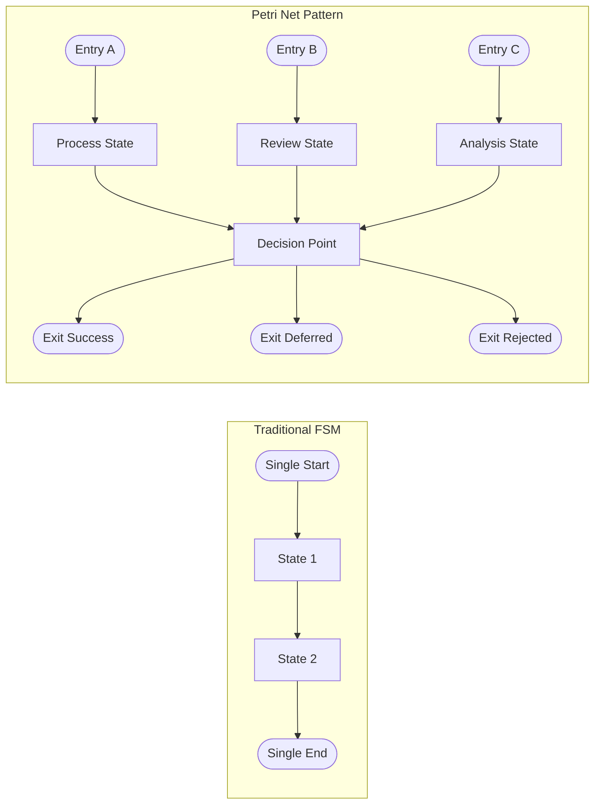

# Adaptive Workflow Architecture: Petri Net Patterns for Flexible System Design

## Executive Summary

Enterprise systems increasingly serve diverse stakeholders who enter workflows at different stages based on their roles, responsibilities, and organizational context. A product manager might initiate a feature request, while a developer inherits an emergency bug fix, and a compliance officer reviews an already-developed solution. Traditional linear workflow systems force all stakeholders through the same entry points and progression paths, creating artificial bottlenecks and poor user experiences.

This document outlines an architectural pattern that applies Petri net principles to both workflow modeling and user interface design, specifically addressing the enterprise reality where different stakeholders need different interaction patterns within the same underlying process framework.

## Overview

The core insight is that enterprise workflows are inherently multi-stakeholder, multi-entry systems. By designing workflows and interfaces that adapt to stakeholder context rather than forcing stakeholders to adapt to rigid system constraints, we can create more efficient and intuitive enterprise tools while maintaining process integrity and governance requirements.

## Problem Statement

Traditional finite state machine (FSM) approaches to workflow and interface design impose rigid constraints:

- **Single Entry Point**: All processes must begin at one designated initial state
- **Linear Progression**: Users/entities must follow predetermined paths
- **Single Exit Condition**: Systems expect one "success" terminal state
- **Context Blindness**: Interfaces provide the same options regardless of current state

These constraints become problematic in:
- Complex enterprise workflows with multiple stakeholders
- Systems where entities can enter at different lifecycle stages
- Environments requiring adaptive, context-sensitive user experiences
- Multi-role systems where different users need different interaction patterns

## Architectural Pattern: Adaptive Workflow with Semantic Guidance

### Core Principles

#### 1. Multi-Entry Workflow Design
Allow entities to enter the system at any logical starting point rather than forcing them through a single initial state.



#### 2. Context-Driven State Transitions
State changes depend on both current state and contextual data (user roles, entity properties, business rules).

#### 3. Semantic Interface Guidance
User interfaces provide contextual hints and suggestions based on current system state and user context.

#### 4. Flexible Termination
Multiple valid completion states rather than binary success/failure outcomes.

### Implementation Architecture

#### Workflow Layer


#### Interface Adaptation Layer


### Design Patterns

#### 1. State-Aware Response Pattern
```markdown
Response Structure:
- Primary Data (answer to user query)
- Contextual Metadata (current state indicators)
- Adaptive Suggestions (relevant next actions)
- Semantic Hints (why these suggestions matter)
```

**Example Implementation:**
```json
{
  "data": { "tasks": [] },
  "metadata": { "totalItems": 0, "filters": {} },
  "suggestions": [
    { "action": "search_entities", "reason": "Find available tasks" },
    { "action": "show_my_bugs", "reason": "Check alternative work items" },
    { "action": "inspect_object", "reason": "Learn system capabilities" }
  ],
  "context": { "state": "no_active_tasks", "role": "developer" }
}
```

#### 2. Multi-Initial State Pattern
Instead of designing workflows with single entry points:


#### 3. Contextual Decision Points
Design transition points that consider multiple factors:


## Implementation Guidelines

### 1. Entity State Design
- Mark appropriate states as `IsInitial: true` to support multiple entry points
- Use `IsFinal: true` for multiple valid completion states
- Assign `Role` associations to states requiring specific expertise
- Implement `NumericPriority` for flexible state ordering

### 2. Transition Logic
- Base transitions on both current state AND contextual data
- Avoid rigid sequential requirements
- Support role-based transition permissions
- Enable data-driven routing decisions

### 3. Interface Adaptation
- Generate suggestions based on current system state
- Provide contextual hints explaining why actions are relevant
- Use progressive disclosure to avoid overwhelming users
- Implement state-aware action filtering

### 4. Error Handling and Recovery
- Design for graceful degradation when entities are in unexpected states
- Provide clear paths to recover from edge cases
- Enable administrative override for exceptional situations
- Log transition decisions for audit and improvement

## Benefits

### Operational Flexibility
- Entities can enter workflows at appropriate lifecycle stages
- Support for emergency/expedited processes
- Accommodation of imported or migrated data
- Reduced artificial bottlenecks

### User Experience
- Context-appropriate interface suggestions
- Reduced cognitive load through relevant options
- Self-guided discovery of system capabilities
- Adaptive learning support

### System Robustness
- Graceful handling of unexpected state combinations
- Support for evolving business processes
- Reduced dependency on rigid sequential processes
- Better error recovery characteristics

## Trade-offs and Considerations

### Complexity
- More complex state management than linear FSMs
- Requires careful design of transition rules
- Testing scenarios increase with flexible entry/exit points

### Predictability
- Less deterministic than traditional workflows
- May require additional documentation for stakeholders
- Audit trails become more important

### Performance
- More decision points may impact system performance
- Context evaluation overhead
- Potential for more complex database queries

## Anti-Patterns to Avoid

### 1. Excessive Initial States
Not every state should be marked as initial. Reserve for legitimate entry points where entities can reasonably begin processing.

### 2. Context Overloading
Avoid making every transition dependent on complex contextual analysis. Some transitions should remain simple and direct.

### 3. Suggestion Spam
Interface hints should be relevant and limited. Too many suggestions create decision paralysis.

### 4. Hidden Dependencies
Ensure that flexible entry points don't bypass critical validation or setup steps.

## Example: Project Management Workflow

Consider a project management system with these entity types:
- **Features**: Can start from "Funnel" (ideation) or "Planned" (committed)
- **User Stories**: Can begin "Open" (new) or "In Progress" (urgent)
- **Bugs**: Can start "Open" (reported) or "Critical" (emergency)
- **Tasks**: Can begin "Open" (planned) or "Blocked" (dependent)

Each entity type supports multiple logical entry points while maintaining workflow integrity through role-based transitions and contextual validation.

## Conclusion

The Petri net-inspired architectural pattern provides a balanced approach to building flexible, adaptive systems. By supporting multiple entry and exit points while maintaining process integrity through contextual decision-making, systems become more resilient and user-friendly without sacrificing governance or auditability.

This pattern particularly benefits complex enterprise environments where rigid workflows create artificial constraints, while the semantic guidance aspect helps users navigate the increased flexibility effectively.

The key is applying these principles judiciously—not every system needs this level of flexibility, but for those that do, this pattern provides a proven architectural foundation.

## References and Further Reading

### Foundational Theory
- **Van der Aalst, W.M.P.** (2016). *Process Mining: Data Science in Action*. Springer. [Comprehensive coverage of workflow patterns and Petri net applications in enterprise systems] - [DOI: 10.1007/978-3-662-49851-4](https://doi.org/10.1007/978-3-662-49851-4)
- **Murata, T.** (1989). "Petri nets: Properties, analysis and applications." *Proceedings of the IEEE*, 77(4), 541-580. [Seminal work on Petri net theory and applications] - [DOI: 10.1109/5.24143](https://doi.org/10.1109/5.24143)
- **Van der Aalst, W.M.P., & ter Hofstede, A.H.M.** (2005). "YAWL: Yet another workflow language." *Information Systems*, 30(4), 245-275. [Practical workflow language based on Petri net principles] - [DOI: 10.1016/j.is.2004.02.002](https://doi.org/10.1016/j.is.2004.02.002)

### Adaptive User Interfaces
- **Oppermann, R., & Rasher, R.** (1997). "Adaptability and adaptivity in learning support systems." *Knowledge Transfer*, 2, 173-179. [Context-aware interface design principles]
- **Jameson, A.** (2003). "Adaptive interfaces and agents." *Human-Computer Interaction: Design Issues, Solutions, and Applications*, 105-130. [Theoretical foundation for adaptive interface systems] - [Available at ResearchGate](https://www.researchgate.net/publication/220604952_Adaptive_Interfaces_and_Agents)
- **Benyon, D., & Murray, D.** (1993). "Adaptive systems: From intelligent tutoring to autonomous agents." *Knowledge-based Systems*, 6(4), 197-219. [Early work on context-sensitive system behavior] - [DOI: 10.1016/0950-7051(93)90012-P](https://doi.org/10.1016/0950-7051(93)90012-P)

### Enterprise Workflow Management
- **Georgakopoulos, D., Hornick, M., & Sheth, A.** (1995). "An overview of workflow management: From process modeling to workflow automation infrastructure." *Distributed and Parallel Databases*, 3(2), 119-153. [Enterprise workflow challenges and solutions] - [DOI: 10.1007/BF01277643](https://doi.org/10.1007/BF01277643)
- **Van der Aalst, W.M.P.** (2013). "Business process management: A comprehensive survey." *ISRN Software Engineering*, 2013. [Modern enterprise workflow patterns and anti-patterns] - [DOI: 10.1155/2013/507984](https://doi.org/10.1155/2013/507984)
- **Dumas, M., La Rosa, M., Mendling, J., & Reijers, H.A.** (2018). *Fundamentals of Business Process Management*. Springer. [Contemporary enterprise process design principles] - [DOI: 10.1007/978-3-662-56509-4](https://doi.org/10.1007/978-3-662-56509-4)

### Context-Aware Computing
- **Dey, A.K.** (2001). "Understanding and using context." *Personal and Ubiquitous Computing*, 5(1), 4-7. [Foundational work on context-aware system design] - [DOI: 10.1007/s007790170019](https://doi.org/10.1007/s007790170019)
- **Chen, G., & Kotz, D.** (2000). "A survey of context-aware mobile computing research." *Technical Report TR2000-381*, Dartmouth College. [Context-aware system architecture patterns] - [Available at Dartmouth](https://www.cs.dartmouth.edu/~dfk/papers/chen:survey-tr.pdf)

### Industry Applications
- **Russell, N., ter Hofstede, A.H.M., Edmond, D., & van der Aalst, W.M.P.** (2005). "Workflow data patterns: Identification, representation and tool support." *Conceptual Modeling–ER 2005*, 353-368. [Practical workflow patterns in enterprise tools] - [DOI: 10.1007/11568322_23](https://doi.org/10.1007/11568322_23)
- **Van der Aalst, W.M.P., ter Hofstede, A.H.M., Kiepuszewski, B., & Barros, A.P.** (2003). "Workflow patterns." *Distributed and Parallel Databases*, 14(1), 5-51. [Comprehensive catalog of workflow patterns including multi-entry scenarios] - [DOI: 10.1023/A:1022883727209](https://doi.org/10.1023/A:1022883727209)

### Implementation Frameworks
- **OASIS WSBPEL Technical Committee** (2007). "Web Services Business Process Execution Language Version 2.0." [Industry standard for flexible workflow implementation] - [Available at OASIS](http://docs.oasis-open.org/wsbpel/2.0/wsbpel-v2.0.html)
- **Object Management Group** (2011). "Business Process Model and Notation (BPMN) Version 2.0." [Visual modeling standards for complex enterprise workflows] - [Available at OMG](https://www.omg.org/spec/BPMN/2.0/)

These references provide both theoretical foundations and practical guidance for implementing Petri net-inspired workflow and interface patterns in enterprise environments.