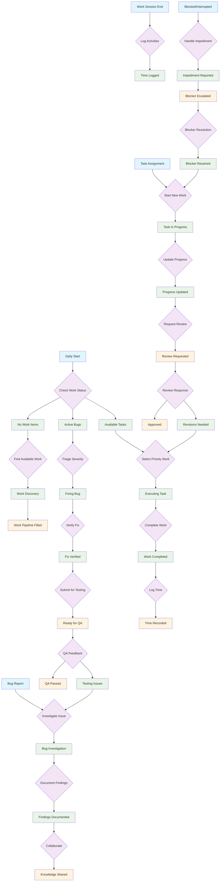

# Developer Workflow Patterns

This document models the Developer semantic workflow patterns, supporting multiple entry points and flexible transitions based on work context.

## Overview

Developers enter workflows at different stages based on their immediate needs:
- **Daily Planning**: Starting fresh, checking assignments
- **Active Work**: Continuing existing tasks
- **Issue Response**: Reacting to bugs or blockers
- **Time Management**: Logging completed work

## Developer Workflow Patterns



## Semantic Operation Mapping

### Entry Point Operations
- **E1 (Daily Start)** → `show-my-tasks`
- **E2 (Task Assignment)** → `start-working-on`
- **E3 (Bug Report)** → `show-my-bugs`
- **E4 (Work Session End)** → `log-time`
- **E5 (Blocked/Interrupted)** → `pause-work`, `report-blocker`

### Core Work Operations
- **Task Execution** → `update-progress`, `complete-task`
- **Bug Investigation** → `investigate-bug`, `mark-bug-fixed`
- **Collaboration** → `add-comment`, `request-review`

### Context-Aware Transitions

#### T1: Check Work Status
```javascript
// Semantic logic for daily work assessment
if (assignedTasks.length > 0) → P1 [Available Tasks]
else if (assignedBugs.filter(critical).length > 0) → P2 [Active Bugs]  
else → P3 [No Work Items]
```

#### T6: Select Priority Work
```javascript
// Priority-based work selection
if (blockedTasks.length > 0) → report-blocker
else if (highPriorityTasks.length > 0) → start-working-on(highPriority[0])
else → start-working-on(nextTask)
```

#### T11: Complete Work
```javascript
// Completion workflow branching
if (requiresReview) → T13 [Request Review]
else if (timeNotLogged) → T15 [Log Time]
else → F3 [Time Recorded]
```

## Workflow Patterns by Context

### Morning Workflow (E1 → Daily Start)
1. `show-my-tasks` → Assess workload
2. `show-my-bugs` → Check critical issues
3. `start-working-on` → Begin highest priority
4. `update-progress` → Regular updates

### Task Completion Workflow (E2 → Task Assignment)
1. `start-working-on` → Begin specific task
2. `update-progress` → Track advancement
3. `complete-task` → Finish work
4. `log-time` → Record effort

### Bug Response Workflow (E3 → Bug Report)
1. `show-my-bugs` → Assess severity
2. `investigate-bug` → Begin diagnosis
3. `add-comment` → Document findings
4. `mark-bug-fixed` → Complete resolution
5. `request-review` → Submit for verification

### Impediment Handling (E5 → Blocked/Interrupted)
1. `pause-work` → Document current state
2. `report-blocker` → Escalate impediment
3. `show-my-tasks` → Find alternative work
4. `start-working-on` → Resume productive work

## Adaptive Suggestions by State

### Available Tasks (P1)
- **High Priority**: `start-working-on` + task with urgent flag
- **Balanced Workload**: `start-working-on` + oldest assigned task
- **Skill Match**: `start-working-on` + task matching developer expertise

### Active Work (P8, P9)
- **Progress Updates**: `update-progress` every 2-4 hours
- **Collaboration**: `add-comment` when questions arise
- **Time Tracking**: `log-time` at natural break points

### Completion States (F1-F8)
- **Review Requested**: Monitor for feedback, prepare for revisions
- **QA Passed**: `log-time` for final accounting, `show-my-tasks` for next work
- **Blocker Escalated**: `show-my-tasks` for alternative work

## State Persistence and Recovery

### Interrupted Workflows
- **Mid-Task Interruption**: Save progress state, enable resume via `show-my-tasks`
- **Context Switch**: `pause-work` preserves task state for later resumption
- **End-of-Day**: `update-progress` + `log-time` maintains workflow continuity

### Error Recovery
- **Failed Transitions**: Provide alternative paths (e.g., if review fails, offer direct completion)
- **Missing Context**: Guide back to appropriate entry point (e.g., `show-my-tasks` for orientation)
- **State Inconsistency**: Offer corrective actions (e.g., state sync operations)

## Implementation Notes

### Token Flow
- Tokens represent work items, developer attention, and task context
- Multiple tokens can exist simultaneously (concurrent work items)
- Token attributes carry state information (priority, complexity, deadline)

### Transition Guards
- Role validation ensures only authorized state changes
- Data validation prevents invalid transitions
- Business rule enforcement maintains workflow integrity

### Place Capacity
- Some places have capacity limits (e.g., "Active Work" limited by focus)
- Overflow handling routes to appropriate queues or escalation paths
- Priority-based token selection when capacity constraints apply