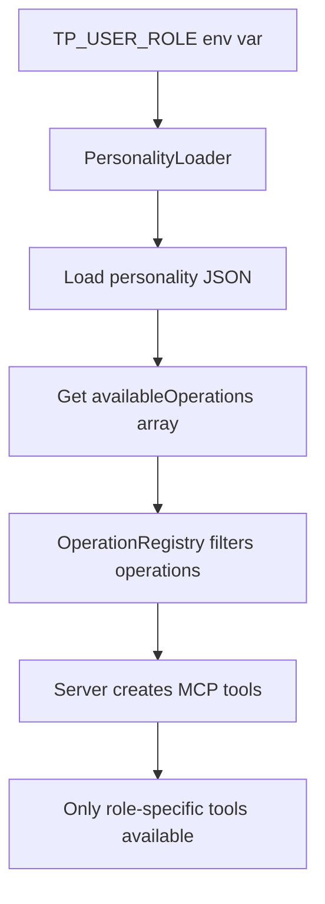

# Personality-Based Type Injection

The TargetProcess MCP uses personality JSON files to dynamically inject which semantic operations are available as MCP tools. This provides role-based access control and customization.

## How It Works

### 1. Environment Variable Sets the Role
```bash
# In .env file
TP_USER_ROLE=developer
```

### 2. Personality JSON Defines Available Operations
```json
// config/personalities/developer.json
{
  "id": "developer",
  "name": "Developer",
  "availableOperations": [
    "show-my-tasks",
    "start-working-on",
    "update-progress",
    "complete-task",
    "log-time"
  ]
}
```

### 3. Server Loads Personality and Registers Tools
```typescript
// In server.ts
private initializeSemanticTools(): void {
  // Get operations for the current user role
  const availableOperations = operationRegistry.getOperationsForPersonality(this.userRole);
  
  // Create individual MCP tools for each semantic operation
  availableOperations.forEach(operation => {
    const toolName = operation.metadata.id.replace(/-/g, '_');
    this.tools[toolName] = this.createSemanticTool(operation);
  });
}
```

### 4. Only Role-Specific Tools Are Available
When the MCP server starts with `TP_USER_ROLE=developer`, only these tools are available:
- `show_my_tasks`
- `start_working_on`
- `update_progress`
- `complete_task`
- `log_time`

## Example: Different Roles Get Different Tools

### Developer Role
```json
{
  "availableOperations": [
    "show-my-tasks",
    "start-working-on",
    "update-progress",
    "complete-task",
    "show-my-bugs",
    "log-time"
  ]
}
```

### Project Manager Role
```json
{
  "availableOperations": [
    "show-team-tasks",
    "show-sprint-status",
    "reassign-task",
    "update-task-priority",
    "show-project-metrics",
    "create-sprint-report"
  ]
}
```

### Administrator Role
```json
{
  "availableOperations": ["*"]  // Wildcard - gets ALL operations
}
```

## Benefits

1. **Security**: Users only see operations relevant to their role
2. **Simplicity**: AI assistants get a focused set of tools
3. **Customization**: Easy to create new roles by adding JSON files
4. **No Code Changes**: Add new personalities without modifying code

## Adding a New Role

1. Create a new JSON file in `config/personalities/`:
```json
// config/personalities/tester.json
{
  "id": "tester",
  "name": "QA Tester",
  "description": "Quality assurance tester focused on bug tracking",
  "availableOperations": [
    "show-bugs-to-test",
    "start-testing",
    "report-test-results",
    "reopen-bug",
    "mark-as-verified"
  ]
}
```

2. Set the environment variable:
```bash
TP_USER_ROLE=tester
```

3. Restart the MCP server - only tester operations will be available!

## Implementation Flow



This architecture ensures that the personality JSON truly "type injects" the available tools into the MCP server based on the user's role.