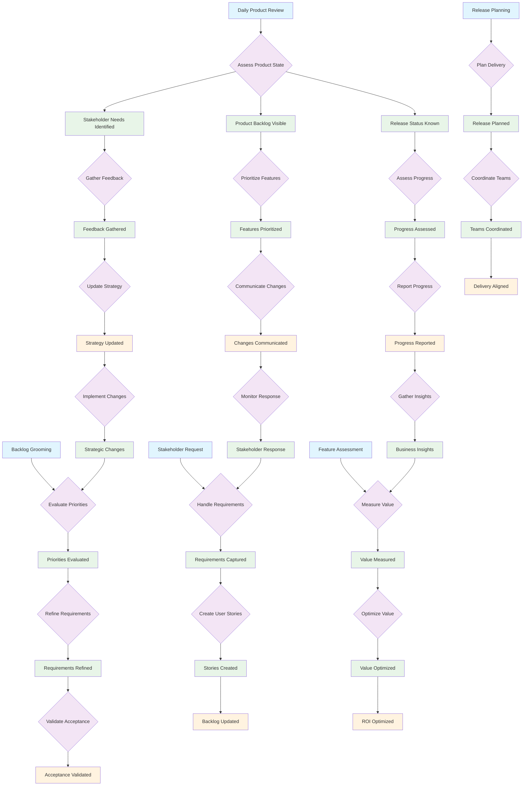

# Product Owner Workflow Patterns

This document models the Product Owner semantic workflow patterns, emphasizing product strategy, backlog management, and stakeholder communication using shared operations and product-specific tools.

## Overview

Product Owners enter workflows at different stages based on product management needs:
- **Backlog Grooming**: Prioritizing and refining the product backlog
- **Stakeholder Communication**: Managing expectations and reporting progress
- **Release Planning**: Coordinating delivery and roadmap alignment
- **Value Assessment**: Measuring feature success and ROI

## Product Owner Workflow Patterns



## Semantic Operation Mapping (Shared + Product-Specific)

### Entry Point Operations
- **E1 (Daily Product Review)** → `manage-product-backlog` (product-specific)
- **E2 (Backlog Grooming)** → `prioritize-features` (product-specific)
- **E3 (Stakeholder Request)** → `add-comment` (shared, product context)
- **E4 (Release Planning)** → `show-release-progress` (product-specific)
- **E5 (Feature Assessment)** → `show-feature-metrics` (product-specific)

### Core Product Operations (Mix of Shared and Specific)
- **Backlog Management** → `manage-product-backlog`, `prioritize-features` (product-specific)
- **Story Creation** → `create-user-story`, `refine-requirements` (product-specific)
- **Progress Tracking** → `show-release-progress`, `log-time` (mix of specific/shared)
- **Communication** → `stakeholder-report`, `add-comment` (mix of specific/shared)

### Context-Aware Transitions

#### T1: Assess Product State
```javascript
// Product health evaluation
if (backlogNeedsGrooming) → P1 [Product Backlog Visible]
else if (releaseAtRisk) → P2 [Release Status Known]
else if (stakeholderFeedbackPending) → P3 [Stakeholder Needs Identified]
```

#### T6: Prioritize Features
```javascript
// Feature prioritization logic
if (businessValueChanges) → `prioritize-features` [adjust priorities]
else if (technicalDependencies) → `add-comment` [document constraints]
else → `manage-product-backlog` [maintain current state]
```

#### T10: Create User Stories
```javascript
// Story creation workflow
if (requirementsWellDefined) → `create-user-story` [formal creation]
else if (needsRefinement) → `refine-requirements` [iterate on details]
else → `add-comment` [capture initial thoughts]
```

## Workflow Patterns by Product Context

### Daily Product Management (E1 → Daily Product Review)
1. `manage-product-backlog` → Review current state and priorities
2. `show-release-progress` → Check delivery status and risks
3. `add-comment` → Document daily observations and decisions
4. `log-time` → Track product management effort

### Backlog Refinement (E2 → Backlog Grooming)
1. `manage-product-backlog` → Assess current backlog state
2. `prioritize-features` → Adjust feature priorities based on feedback
3. `refine-requirements` → Add detail to upcoming stories
4. `create-user-story` → Create new stories as needed

### Stakeholder Management (E3 → Stakeholder Request)
1. `add-comment` → Document stakeholder input and requests
2. `create-user-story` → Convert requests into actionable stories
3. `stakeholder-report` → Prepare comprehensive status updates
4. `schedule-stakeholder-review` → Organize review sessions

### Release Coordination (E4 → Release Planning)
1. `show-release-progress` → Assess current release status
2. `plan-roadmap` → Align features with strategic timeline
3. `prioritize-features` → Ensure release scope alignment
4. `stakeholder-report` → Communicate release plans

## Adaptive Suggestions by Product Context

### Backlog Management (P1, P8, F5)
- **High-Priority Features**: `prioritize-features` with business value focus
- **Story Readiness**: `refine-requirements` for upcoming sprints
- **Capacity Planning**: `manage-product-backlog` with team velocity

### Stakeholder Communication (P3, P15, F1-F2)
- **Status Updates**: `stakeholder-report` with appropriate audience level
- **Feedback Integration**: `add-comment` for stakeholder input documentation
- **Decision Communication**: `schedule-stakeholder-review` for major changes

### Value Assessment (P7, P14, F7)
- **Feature Performance**: `show-feature-metrics` for ROI analysis
- **Strategy Adjustment**: `plan-roadmap` based on performance data
- **Priority Updates**: `prioritize-features` driven by value metrics

## State Persistence and Product Recovery

### Interrupted Product Workflows
- **Mid-Planning Interruption**: Save planning state via `add-comment`
- **Stakeholder Emergency**: Use `stakeholder-report` for rapid status generation
- **End-of-Day Review**: Use `log-time` to capture product activities

### Strategic Recovery Patterns
- **Failed Initiatives**: Alternative paths via `show-feature-metrics` analysis
- **Missing Context**: Guide back to `manage-product-backlog` for orientation
- **State Inconsistency**: Use `show-release-progress` for delivery visibility

## Operation Classification

### Shared Operations (Used by Multiple Roles)
- `add-comment` - Documentation (product context: business decisions, requirements)
- `log-time` - Time tracking (product context: product management activities)

### Product-Specific Operations
- `manage-product-backlog` - Comprehensive backlog view with business value
- `prioritize-features` - Business-driven feature prioritization
- `create-user-story` - Story creation with acceptance criteria
- `refine-requirements` - Requirement clarification and detail addition
- `show-release-progress` - Release tracking with business metrics
- `stakeholder-report` - Business-focused progress reporting
- `review-sprint-deliverables` - Product acceptance and demo preparation
- `update-acceptance-criteria` - Acceptance criteria management
- `show-feature-metrics` - Feature performance and ROI analysis
- `plan-roadmap` - Strategic product roadmap planning
- `schedule-stakeholder-review` - Stakeholder meeting coordination

## Implementation Notes

### Token Flow (Product Perspective)
- Tokens represent features, stakeholder feedback, and business value
- Multiple concurrent tokens for parallel product management activities
- Token attributes carry business priority, market timing, and ROI potential

### Transition Guards (Product Context)
- Business value validation before priority changes
- Stakeholder approval requirements for scope changes
- Market timing considerations for roadmap decisions

### Place Capacity (Product Resource Management)
- Development capacity limits for feature planning
- Stakeholder bandwidth constraints for review cycles
- Market window constraints for feature delivery timing

## Key Design Principles

### Strategic Operation Usage
- **Business-Focused Tools**: Product-specific operations emphasize value and ROI
- **Stakeholder Communication**: Enhanced reporting and coordination capabilities
- **Shared Collaboration**: Leverage common operations for team coordination
- **Context Adaptation**: Operations provide product-centric views and suggestions

### Product-Specific Adaptations
- **Value Optimization**: Emphasis on business value and market impact
- **Stakeholder Alignment**: Tools for managing external communication
- **Strategic Planning**: Long-term roadmap and release coordination
- **Performance Tracking**: Feature success metrics and ROI analysis