# Project Manager Workflow Patterns

This document models the Project Manager semantic workflow patterns, emphasizing oversight, resource management, and stakeholder coordination using shared semantic operations.

## Overview

Project Managers enter workflows at different stages based on management needs:
- **Resource Planning**: Assessing team capacity and workload
- **Progress Monitoring**: Tracking delivery status and risks
- **Stakeholder Management**: Reporting and communication requirements
- **Issue Escalation**: Handling blockers and impediments

## Project Manager Workflow Patterns

```mermaid
graph TB
    %% Entry Points (Places)
    E1[Daily Standup] --> T1{Assess Team Status}
    E2[Sprint Planning] --> T2{Plan Resource Allocation}
    E3[Escalation Request] --> T3{Handle Impediment}
    E4[Stakeholder Check-in] --> T4{Prepare Status Update}
    E5[Release Planning] --> T5{Review Progress}

    %% Core Workflow Transitions
    T1 --> P1[Team Workload Visible]
    T1 --> P2[Blocked Items Identified]
    T1 --> P3[Progress Concerns]

    T2 --> P4[Resources Allocated]
    T3 --> P5[Impediment Documented]
    T4 --> P6[Status Report Ready]
    T5 --> P7[Release Assessment]

    %% Management Analysis Places
    P1 --> T6{Evaluate Capacity}
    P2 --> T7{Prioritize Blockers}
    P3 --> T8{Assess Risk Level}

    T6 --> P8[Capacity Understood]
    T7 --> P9[Blockers Prioritized]
    T8 --> P10[Risks Assessed]

    %% Action and Response
    P4 --> T9{Monitor Progress}
    P5 --> T10{Escalate/Resolve}
    P6 --> T11{Communicate Status}
    P7 --> T12{Plan Adjustments}

    T9 --> P11[Progress Tracked]
    T10 --> P12[Impediment Resolved]
    T11 --> P13[Stakeholders Informed]
    T12 --> P14[Plans Adjusted]

    %% Coordination and Oversight
    P8 --> T13{Rebalance Workload}
    P9 --> T14{Remove Barriers}
    P10 --> T15{Mitigate Risks}
    P11 --> T16{Update Forecasts}

    %% Final States (Multiple Exit Points)
    T13 --> F1[Team Optimized]
    T14 --> F2[Blockers Cleared]
    T15 --> F3[Risks Mitigated]
    T16 --> F4[Forecasts Updated]
    P12 --> F5[Issue Resolved]
    P13 --> F6[Status Communicated]
    P14 --> F7[Plans Synchronized]

    %% Feedback Loops
    F1 --> T17{Monitor Effectiveness}
    F2 --> T18{Verify Resolution}
    F3 --> T19{Track Risk Status}

    T17 --> P15[Team Performance]
    T18 --> P16[Resolution Verified]
    T19 --> P17[Risk Status Updated]

    P15 --> T1
    P16 --> T7
    P17 --> T8

    %% Styling
    classDef entryPoint fill:#e1f5fe
    classDef transition fill:#f3e5f5
    classDef workState fill:#e8f5e8
    classDef finalState fill:#fff3e0

    class E1,E2,E3,E4,E5 entryPoint
    class T1,T2,T3,T4,T5,T6,T7,T8,T9,T10,T11,T12,T13,T14,T15,T16,T17,T18,T19 transition
    class P1,P2,P3,P4,P5,P6,P7,P8,P9,P10,P11,P12,P13,P14,P15,P16,P17 workState
    class F1,F2,F3,F4,F5,F6,F7 finalState
```



## Semantic Operation Mapping (Reusing Shared Operations)

### Entry Point Operations
- **E1 (Daily Standup)** → `show-my-tasks` (view team assignments)
- **E2 (Sprint Planning)** → `show-my-bugs` (assess impediments)
- **E3 (Escalation Request)** → `add-comment` (document issues)
- **E4 (Stakeholder Check-in)** → `log-time` (prepare reports)
- **E5 (Release Planning)** → `show-my-tasks` (review deliverables)

### Management Operations (using shared tools with manager context)
- **Resource Assessment** → `show-my-tasks` (team workload view)
- **Progress Tracking** → `show-my-bugs` (impediment visibility)
- **Documentation** → `add-comment` (status updates)
- **Time Management** → `log-time` (capacity tracking)

### Context-Aware Transitions

#### T1: Assess Team Status
```javascript
// Management perspective on team state
if (blockedTasks.length > 0) → P2 [Blocked Items Identified]
else if (overloadedTeamMembers.length > 0) → P1 [Team Workload Visible]
else if (riskIndicators.length > 0) → P3 [Progress Concerns]
```

#### T6: Evaluate Capacity
```javascript
// Capacity management decisions
if (teamOverloaded) → T13 [Rebalance Workload]
else if (teamUnderUtilized) → T2 [Plan Resource Allocation]
else → F1 [Team Optimized]
```

#### T10: Escalate/Resolve
```javascript
// Impediment handling workflow
if (canResolveDirectly) → `add-comment` + resolve
else if (needsDeveloperInput) → `show-my-tasks` [check dependencies]
else → escalate to stakeholders
```

## Workflow Patterns by Context

### Daily Management Workflow (E1 → Daily Standup)
1. `show-my-tasks` → View team assignments and capacity
2. `show-my-bugs` → Identify blockers and impediments
3. `add-comment` → Document observations and actions
4. `log-time` → Update project tracking

### Sprint Planning Workflow (E2 → Sprint Planning)
1. `show-my-tasks` → Review available work items
2. `show-my-bugs` → Assess known impediments
3. `add-comment` → Record planning decisions
4. `log-time` → Track planning effort

### Issue Escalation Workflow (E3 → Escalation Request)
1. `add-comment` → Document the impediment
2. `show-my-tasks` → Assess impact on deliverables
3. `show-my-bugs` → Check for related issues
4. `log-time` → Track resolution effort

### Stakeholder Communication Workflow (E4 → Stakeholder Check-in)
1. `show-my-tasks` → Gather progress data
2. `show-my-bugs` → Identify risks and issues
3. `add-comment` → Prepare status summary
4. `log-time` → Document communication time

## Adaptive Suggestions by Management Context

### Team Workload Assessment (P1)
- **Overloaded Team**: `show-my-tasks` filtered by team member workload
- **Capacity Available**: `show-my-tasks` to identify additional work
- **Skills Mismatch**: `add-comment` to document resource needs

### Impediment Management (P2, P9)
- **Technical Blockers**: `show-my-bugs` filtered by severity
- **Resource Constraints**: `add-comment` for escalation documentation
- **Process Issues**: `log-time` for impact assessment

### Progress Monitoring (P11, F4)
- **On Track**: `show-my-tasks` for continuous monitoring
- **Behind Schedule**: `add-comment` for mitigation planning
- **Ahead of Schedule**: `log-time` for capacity reallocation

## State Persistence and Management Recovery

### Interrupted Management Workflows
- **Mid-Planning Interruption**: Save planning state via `add-comment`
- **Emergency Response**: Use `show-my-bugs` to assess critical issues
- **End-of-Day Review**: Use `log-time` to capture management activities

### Escalation Recovery
- **Failed Resolutions**: Alternative paths via `add-comment` documentation
- **Missing Context**: Guide back to `show-my-tasks` for situational awareness
- **State Inconsistency**: Use `show-my-bugs` for issue discovery

## Implementation Notes

### Token Flow (Management Perspective)
- Tokens represent team capacity, project milestones, and stakeholder expectations
- Multiple concurrent tokens for parallel team management activities
- Token attributes carry priority, team assignment, and deadline information

### Transition Guards (Management Context)
- Role validation for management-level state changes
- Team capacity validation before workload adjustments
- Stakeholder approval requirements for significant changes

### Place Capacity (Resource Management)
- Team capacity limits enforced at workload assignment places
- Escalation queues with priority-based processing
- Resource allocation constraints based on skills and availability

## Key Design Principles

### Shared Operation Usage
- **No Duplicate Tools**: Reuse `show-my-tasks`, `show-my-bugs`, `add-comment`, `log-time`
- **Context-Driven Results**: Same operations provide manager-focused views
- **Role-Based Filtering**: Operations adapt results based on management role
- **Workflow Continuity**: Seamless transition between management activities

### Management-Specific Adaptations
- **Team-Level Aggregation**: Operations show team-wide views vs individual views
- **Risk Assessment**: Enhanced focus on impediments and delivery risks
- **Stakeholder Perspective**: Results formatted for management reporting
- **Resource Optimization**: Emphasis on capacity and allocation insights