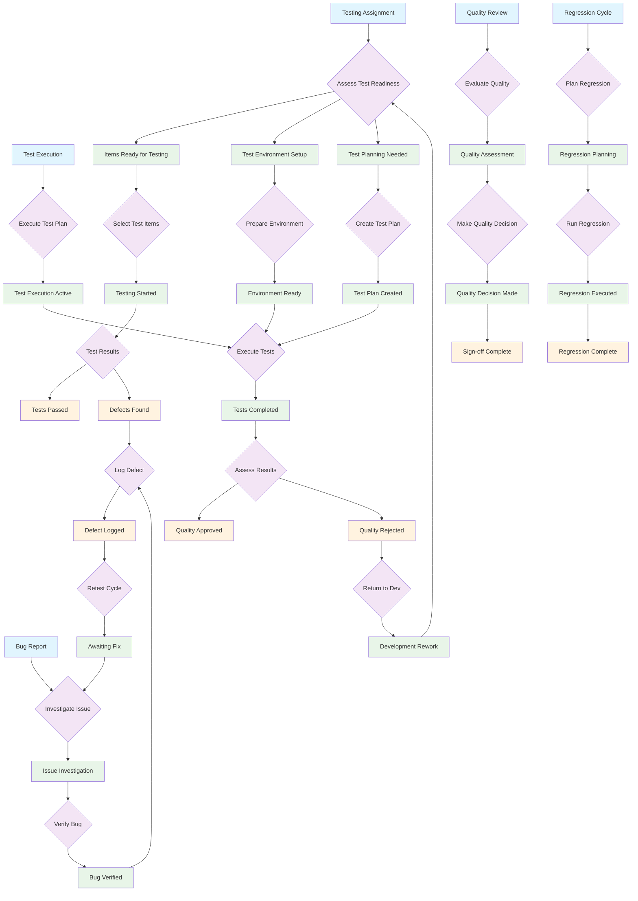

# QA Tester Workflow Patterns

This document models the QA Tester semantic workflow patterns, emphasizing quality assurance processes while leveraging both shared operations and tester-specific tools.

## Overview

QA Testers enter workflows at different stages based on testing needs:
- **Test Planning**: Preparing for testing cycles
- **Test Execution**: Active testing and verification
- **Defect Management**: Finding and tracking issues
- **Quality Assessment**: Approval and sign-off processes

## QA Tester Workflow Patterns



## Semantic Operation Mapping (Shared + Tester-Specific)

### Entry Point Operations
- **E1 (Testing Assignment)** → `show-items-for-testing` (tester-specific)
- **E2 (Bug Report)** → `show-my-bugs` (shared, tester context)
- **E3 (Test Execution)** → `start-testing` (tester-specific)
- **E4 (Quality Review)** → `show-defect-metrics` (tester-specific)
- **E5 (Regression Cycle)** → `create-regression-suite` (tester-specific)

### Core Testing Operations (Mix of Shared and Specific)
- **Test Management** → `start-testing`, `execute-test-suite` (tester-specific)
- **Quality Assessment** → `approve-testing`, `reject-with-bugs` (tester-specific)
- **Defect Handling** → `log-defect` (tester-specific), `add-comment` (shared)
- **Time Tracking** → `log-time` (shared, testing context)

### Context-Aware Transitions

#### T1: Assess Test Readiness
```javascript
// Testing readiness evaluation
if (itemsReadyForTesting.length > 0) → P1 [Items Ready for Testing]
else if (environmentIssues) → P2 [Test Environment Setup]
else → P3 [Test Planning Needed]
```

#### T10: Execute Tests
```javascript
// Test execution decision tree
if (manualTestsRequired) → `execute-test-suite` [manual execution]
else if (automatedTestsAvailable) → `execute-test-suite` [automated]
else → `create-test-run` [setup required]
```

#### T15: Assess Results
```javascript
// Quality decision making
if (allTestsPassed && noCriticalIssues) → F4 [Quality Approved]
else if (criticalDefectsFound) → F5 [Quality Rejected]
else → `log-defect` [document issues]
```

## Workflow Patterns by Testing Context

### Daily Testing Workflow (E1 → Testing Assignment)
1. `show-items-for-testing` → Check testing queue
2. `start-testing` → Begin testing specific items
3. `execute-test-suite` → Run test cases
4. `log-defect` → Document any issues found
5. `approve-testing` → Sign off on quality

### Bug Investigation Workflow (E2 → Bug Report)
1. `show-my-bugs` → Review reported issues
2. `add-comment` → Document investigation notes
3. `start-testing` → Verify bug reproduction
4. `log-defect` → Confirm or update defect details

### Test Execution Workflow (E3 → Test Execution)
1. `start-testing` → Begin systematic testing
2. `create-test-run` → Set up formal test execution
3. `execute-test-suite` → Run comprehensive tests
4. `log-time` → Track testing effort
5. `approve-testing` OR `reject-with-bugs` → Quality decision

### Quality Review Workflow (E4 → Quality Review)
1. `show-defect-metrics` → Analyze quality trends
2. `show-items-for-testing` → Review testing progress
3. `add-comment` → Document quality assessment
4. `approve-testing` → Final quality sign-off

## Adaptive Suggestions by Testing Context

### Test Planning Phase (P3, P10)
- **New Features**: `show-items-for-testing` filtered by feature type
- **Bug Fixes**: `show-my-bugs` for verification testing
- **Regression Needs**: `create-regression-suite` for systematic coverage

### Active Testing (P5, P8, P12)
- **Test Execution**: `execute-test-suite` with appropriate test cases
- **Issue Discovery**: `log-defect` for immediate documentation
- **Progress Tracking**: `log-time` for effort recording

### Quality Assessment (P6, P13, F4-F5)
- **Approval Process**: `approve-testing` for passed items
- **Rejection Process**: `reject-with-bugs` with defect details
- **Documentation**: `add-comment` for quality rationale

## State Persistence and Testing Recovery

### Interrupted Testing Workflows
- **Mid-Test Interruption**: Save test state via `add-comment`
- **Environment Issues**: Use `show-items-for-testing` to find alternatives
- **End-of-Day**: Use `log-time` to record testing activities

### Quality Recovery Patterns
- **Failed Tests**: Alternative paths via `log-defect` and `reject-with-bugs`
- **Missing Context**: Guide back to `show-items-for-testing` for orientation
- **State Inconsistency**: Use `show-defect-metrics` for quality visibility

## Operation Classification

### Shared Operations (Used by Multiple Roles)
- `show-my-bugs` - Bug visibility (tester context: assigned bugs to verify)
- `add-comment` - Documentation (tester context: test notes, findings)
- `log-time` - Time tracking (tester context: testing effort)

### Tester-Specific Operations
- `show-items-for-testing` - Test queue management
- `start-testing` - Test initiation and assignment
- `execute-test-suite` - Test case execution
- `create-test-run` - Formal test execution setup
- `approve-testing` - Quality sign-off
- `reject-with-bugs` - Quality rejection with defects
- `log-defect` - Defect documentation and tracking
- `show-defect-metrics` - Quality analytics
- `create-regression-suite` - Regression test planning
- `show-my-test-cases` - Test case management

## Implementation Notes

### Token Flow (Testing Perspective)
- Tokens represent test items, defects, and quality states
- Multiple concurrent tokens for parallel testing activities
- Token attributes carry test complexity, priority, and quality metrics

### Transition Guards (Testing Context)
- Quality gate validation before approval transitions
- Test coverage requirements for sign-off processes
- Defect severity thresholds for rejection decisions

### Place Capacity (Testing Resource Management)
- Testing environment capacity limits
- Defect triage queues with severity-based prioritization
- Test execution slots based on tester availability

## Key Design Principles

### Balanced Operation Usage
- **Core Operations Shared**: Basic workflow operations reused across roles
- **Domain-Specific Tools**: Testing-specific operations for specialized workflows
- **Context Adaptation**: Shared operations provide tester-focused results
- **Role Boundaries**: Clear separation between shared and specialized functionality

### Testing-Specific Adaptations
- **Quality Focus**: Emphasis on defect detection and quality metrics
- **Test Coverage**: Systematic approach to test case execution
- **Risk Assessment**: Quality-based decision making for approvals
- **Collaborative Testing**: Integration with development and product teams